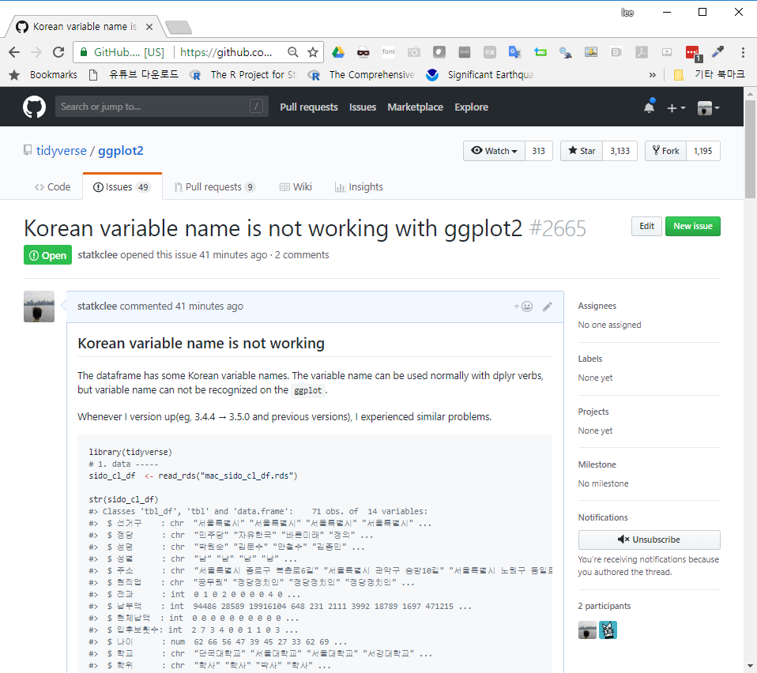

```{r setup, include=FALSE}
knitr::opts_chunk$set(echo = TRUE)
```


``` {r, include=FALSE}

# 0. 환경설정 --------------
library(timelineS) # devtools::install_github("daheelee/timelineS")
library(tidyverse)
library(lubridate)

Sys.setenv(TZ='Asia/Seoul')

rhistory_df <- tribble(
    ~event, ~event_date, ~event_eng,
    "R 개발시작", "1992-07-01", "R development begins as a research project in Auckland, NZ by Robert Gentleman and Ross Ihaka",
    "R 배포", "1993-07-01", "First binary versions of R published at Statlib",
    "GPL 소스코드 \n 배포", "1995-07-01", "R first distributed as open-source software, under GPL2 license",
    "R 그룹 생성", "1997-07-01", "R core group formed",
    "CRAN 시작", "1997-07-01", "CRAN founded (by Kurt Jornik and Fritz Leisch)",
    "R 웹사이트", "1999-07-01", "The R website, r-project.org, founded",
    "R 개발자 \n 모임", "1999-07-01", "First in-person meeting of R Core team, at inaugural Directions in Statistical Computing conference, Vienna",
    "R 1.0.0 배포", "2000-02-29", "R 1.0.0 released (February 29)",
    "John Chambers \n ACM 수상", "2000-07-01", "John Chambers, recipient of the 1998 ACM Software Systems Award for the S language, joins R Core",
    "R 소식지 창단", "2001-07-01", "R News founded (later to become the R Journal)",
    "R 재단 창설", "2003-07-01", "R Foundation founded",
    "UseR! 컨퍼런스 시작", "2004-07-01", "First UseR! conference (in Vienna)",
    "R 2.0.0 배포", "2004-07-01", "R 2.0.0 released",
    "첫 R 저널 배포", "2009-07-01", "First edition of the R Journal",
    "R 3.0.0 배포", "2013-07-01", "R 3.0.0 released",
    "R 컨소시엄 창설", "2015-07-01", "R Consortium founded, with R Foundation participation",
    "신규 R 로고 채택", "2016-07-01", "New R logo adopted",
    "한국 R Meetup", "2017-08-23", "한국 R Meetup 시작"
)

```

> ## 학습 목표 {.objectives}
>
> * R 언어의 역사를 이해한다.
> * 통계 팩키지와 다른 데이터과학 언어를 R 언어과 비교한다.
> * 사용자와 개발자를 나누는 사회적 장벽을 이해하고, 두언어 문제를 살펴본다.
> * 주요 R언어 구문을 이해한다.
> * R 언어 시작과 끝을 맛본다.


# 그림 삽입{#insert-figure}


# 주석 삽입{#insert-reference}

데이터 마이닝 모형이었다. [^crisp-dm-kor]

[^crisp-dm-kor]: [데이터 마이닝 방법론/프로세스 CRISP-DM](http://itlab.tistory.com/122)
입

# 연대기 표 삽입{#insert-yearly}

``` {r rhistory, fig.width=12}
# 1. R 역사 연대기 표 --------------

DT::datatable(rhistory_df)

# 2. R 역사 연대기 시각화 --------------

rhistory_df <- rhistory_df %>% 
    mutate(event_date = ymd(event_date))

timelineS(rhistory_df, main = "R 연대기", buffer.days = 3600,
          label.direction = "up", label.length = c(0.2,0.8,0.4,1.2), label.position = 3,
          labels = rhistory_df[[1]])
```


# 웹데이터 읽기 {#webdata-read}


``` {r r-lang-import, message=FALSE, warning=FALSE, comment=FALSE}
abalone <- read.csv(url("http://archive.ics.uci.edu/ml/machine-learning-databases/abalone/abalone.data"), header=F)
names(abalone) <- c("Sex","Length","Diameter","Height","Whole weight","Shucked weight","Viscera weight","Shell weight","Rings")
head(abalone)
```


# 콘솔 정리

__함수로 구현__

초기 실행 환경파일(`C:\Program Files\R\R-3.1.0\library\base\R\RProfile`)에 포함

``` {r r-lang-cls}
cls <- function() cat(rep("\n",50))
cls()
```

__`CTRL+L` 키__

화면을 깨끗이하며 커서를 맨 위 상단으로 이동한다.

```{r r-lang-cls-rprofile}
local({
    br <- Sys.getenv("R_BROWSER", NA_character_)
    if(!is.na(br)) options(browser = br)
    tests_startup <- Sys.getenv("R_TESTS")
    if(nzchar(tests_startup)) source(tests_startup)
})

# 사용자 정의함수
cls <- function() cat(rep("\n",50))
```


# 문제해결 {#we-have-some-concern}

도움이 될 수 있는 R 팩키지가 나왔다. [reprex](http://reprex.tidyverse.org/)는
**repr**oducible **ex**ample 의 줄임말로 [GitHub issues](https://guides.github.com/features/issues/), 
[stackoverflow](https://stackoverflow.com/questions/tagged/r), [Slack snippets](https://get.slack.help/hc/en-us/articles/204145658-Create-a-snippet)에 


# 동영상 삽입 

<iframe width="300" height="180" src="https://www.youtube.com/embed/ft_rdnFKvnc" frameborder="0" allow="autoplay; encrypted-media" allowfullscreen></iframe>

# `reprex` 사용법 {#reprex}

`reprex` 사용법은 생각보다 단순하다.

1. R 코드를 복사해서 클립보드에 집어넣는다.
1. `library(reprex)` 팩키지를 불러오고 `reprex()`을 실행한다.
1. **RStudio’s Viewer** 패널에 R 코드 실행결과가 나타난다.
    - R 코드와 R코드 실행결과를 적절히 사용해서... [GitHub issues](https://guides.github.com/features/issues/), 
[stackoverflow](https://stackoverflow.com/questions/tagged/r), [Slack snippets](https://get.slack.help/hc/en-us/articles/204145658-Create-a-snippet)에 활용한다.

# `github` 이슈등록 [^reprex-tutorial] {#reprex-github}

[^reprex-tutorial]: [Render a reprex](http://reprex.tidyverse.org/reference/reprex.html)

R 버전을 올리고, 새로운 `tidyverse` 팩키지의 기능개선 버젼이 생겨날 때마다 
한국어를 모국어로 하고 데이터를 분석하는 데이터과학자는 항상 동일한 문제에 직면한다.
바로, 한국어를 객체나 데이터프레임 변수명으로 사용하게 되는 경우 오류가 발생하는 경우가 비일비재하다.

이럴 때, 즉시, `tidyverse`의 일원인 `ggplot2`에 해당내용을 정리해서 버그나 이슈를 제보하고자 하는 경우,
`reprex()` 함수를 사용하면 유용하다. 기본적인 사용법은 위와 유사하나 
[Github: Korean variable name is not working with ggplot2 #2665](https://github.com/tidyverse/ggplot2/issues/2665)에 등록하기 위해서 다음 몇가지 사항에 유의한다.

1. 데이터 위치 작업 디렉토리
    - `getwd()` 함수로 작업 디렉토리를 파악한다.
    - `setwd()` 명령어로 데이터가 위치한 디렉토리를 지정한다.
1. R코드가 1줄 이상이 되는 경우 `reprex()` 함수내부에 `{}` 넣어 R코드를 작성한다.
1. 주석은 `#``을 붙여 R코드와 설명되는 내용이 함께 붙여 놓는다.
1. `si=TRUE, venue = "gh"`와 같은 내용을 추가하여 `sessionInfo()`와 `gh`은 GitHub으로 도움말을 활용할 곳을 지정한다.
1. `reprex({...})`를 실행하게 되면 클립보드에 내용이 자동저장되기 때문에 해당 GitHub 이슈나 Stackoverflow 페이지에 붙여넣고 불필요한 부분 편집하면 된다.

- [Korean variable name is not working with ggplot2 #2665](https://github.com/tidyverse/ggplot2/issues/2665)

```{r github-reprex-issue}
library(reprex)
library(tidyverse)

reprex({
    
    #' ## Korean variable name is not working  
    #' 
    #' The dataframe has some Korean variable names.
    #' The variable name can be used normally with dplyr verbs,
    #' but variable name can not be recognized on the ggplot.
    #' 
    
    library(tidyverse)
    # 1. data -----
    sido_cl_df  <- read_rds("data/mac_sido_cl_df.rds")
    
    str(sido_cl_df)
    
    # 2. viz -----
    ## 2.1. error
    sido_cl_df %>% 
        ggplot(aes(x=납부액, y=입후보횟수)) +
        geom_point() +
        scale_x_log10() +
        geom_smooth(stat="smooth")
    
    ## 2.2. walkaround
    sido_cl_df %>% 
        rename(num_run = "입후보횟수",
               pay_amt = "납부액") %>% 
        ggplot(aes(x=pay_amt, y=num_run)) +
        geom_point() +
        scale_x_log10() +
        geom_smooth(stat="smooth")
}, si=TRUE, venue = "gh")

```




