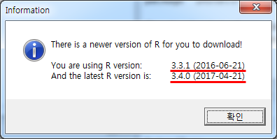
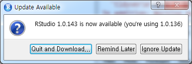

```{r setup, include=FALSE}
knitr::opts_chunk$set(echo = TRUE)
```

> ## 학습 목표 {.objectives}
>
> * R 업그레이드할 때 필요한 사항을 숙지한다.
> * R 코어엔진, RStudio 통합개발환경, 팩키지에 대해 이해한다.
> * R 시작할 때 반복적으로 실행하는 작업을 자동화한다.

## R, RStudio, 팩키지 업그레이드

[How to Upgrade R Without Losing Your Packages from Data Science Riot!](https://www.datascienceriot.com/how-to-upgrade-r-without-losing-your-packages/kris/)


## R 엔진 업그레이드 

### R 버젼확인 

`sessionInfo()` 명령어를 통해서 현재 버전을 확인

``` {r r-sessionInfo, eval=FALSE}
sessionInfo()
```

``` {r r-sessionInfo-output, eval=FALSE}
R version 3.2.3 (2015-12-10)
Platform: x86_64-w64-mingw32/x64 (64-bit)
Running under: Windows >= 8 x64 (build 9200)

locale:
[1] LC_COLLATE=Korean_Korea.949  LC_CTYPE=Korean_Korea.949   
[3] LC_MONETARY=Korean_Korea.949 LC_NUMERIC=C                
[5] LC_TIME=Korean_Korea.949    

attached base packages:
[1] stats     graphics  grDevices utils     datasets 
[6] methods   base     

loaded via a namespace (and not attached):
[1] tools_3.2.3
```

### R 엔진 업그레이드 (우분투 리눅스) 

몇가지 방법을 사용해서 최신 R 버전으로 업그레이드가 가능하다.
[R 저장소](https://cran.r-project.org/bin/linux/ubuntu/)를 `/etc/apt/sources.list` 파일에 추가해서 
최신 R을 설치하는 것도 한 방법이다. 우분투 trusty R 최신버젼 설치에 대한 자세한 원문은 
[CRAN 웹사이트](http://cran.r-project.org/bin/linux/ubuntu/)를 참조한다.

1. `/etc/apt/sources.list` 파일 하단에 `deb http://cran.rstudio.com/bin/linux/ubuntu precise/` 내용을 추가한다.
    - [CRAN 미러](http://cran.r-project.org/mirrors.html)에서 버클리 대학이 과거 많이 참조되었으나 `rstudio`로 선정했는데, 다른 곳을 지정해도 된다.

``` {r r-ubuntu-edit, eval=FALSE}
ubuntu@ip-172-31-22-122:~$ sudo nano /etc/apt/sources.list
```

2. 최신정보로 갱신하고 바이러리 R을 설치한다. 만약 소스코드에 R 팩키지를 컴파일한다면 `r-base-dev` 도 함께 설치한다.

``` {r r-ubuntu-install, eval=FALSE}
ubuntu@ip-172-31-22-122:~$ sudo apt-get update && sudo apt-get install r-base
ubuntu@ip-172-31-22-122:~$ sudo apt-get install r-base-dev
```

3. 원문은 [스택오버플러어 웹사이트](http://stackoverflow.com/questions/10476713/how-to-upgrade-r-in-ubuntu), 혹은 
[How do I install/upgrade r-base to the latest version?](https://askubuntu.com/questions/431380/how-do-i-install-upgrade-r-base-to-the-latest-version)을 참조한다.

``` {r r-ubuntu-run, eval=FALSE}
ubuntu@ip-172-31-22-122:~$ R

R version 3.4.1 (2017-06-30) -- "Single Candle"
Copyright (C) 2017 The R Foundation for Statistical Computing
Platform: x86_64-pc-linux-gnu (64-bit)

R is free software and comes with ABSOLUTELY NO WARRANTY.
You are welcome to redistribute it under certain conditions.
Type 'license()' or 'licence()' for distribution details.

  Natural language support but running in an English locale

R is a collaborative project with many contributors.
Type 'contributors()' for more information and
'citation()' on how to cite R or R packages in publications.

Type 'demo()' for some demos, 'help()' for on-line help, or
'help.start()' for an HTML browser interface to help.
Type 'q()' to quit R.

>
```

또 다른 방법은 [Michael Rutter PPA](https://askubuntu.com/questions/909689/upgrading-r-version-3-3-in-ubuntu-16-04/912292)을 이용하는 방식으로 
[Michael Rutter](https://launchpad.net/~marutter/+archive/ubuntu/rrutter)님께서 PPA를 꾸준히 갱신하고 있다.
사용법은 다음과 같다. **PPA(Personal Package Archive)**는 우분투 개인 패키지 저장소로,
PPA는 런치패드(유명한 패키지 저장소중 하나)에서 제공하는 우분투의 공식 패키지 저장소에 없는 
서드 파티 소프트웨어를 위한 개인용 소프트웨어 패키지 저장소다. 사실 우분투 입장에서 보면 R은 그다지 중요한 핵심 팩키지는 아닐 수 있다.

``` {r install-latest-r-ppa, eval=FALSE}
ubuntu@ip-172-31-22-122:~$ sudo add-apt-repository ppa:marutter/rrutter
ubuntu@ip-172-31-22-122:~$ sudo apt update
ubuntu@ip-172-31-22-122:~$ sudo apt full-upgrade
```

### R 엔진 업그레이드 (레드햇 리눅스)

[^r-rhel-install]: [Install R and R packages on RHEL 6 (x86_64)](http://jianlu.github.io/2016/02/10/Install-R-and-R-Packages-on-RHEL6/)

클라우드 AWS 서비스를 사용하게 되면 redhat 계열 리눅스에 R을 올려 사용하게 된다.
이런 경우, RHEL 6에서 돌아가는 R을 설치하는 방법은 [EPEL (Extra Packages for Enterprise Linux)](https://fedoraproject.org/wiki/EPEL)에 등록된
R 버젼을 설치해서 사용하는 것이다.


``` {r r-redhat-linux, eval=FALSE}
sudo rpm -Uvh http://download.fedoraproject.org/pub/epel/6/i386/epel-release-6-8.noarch.rpm
sudo yum update -y
sudo yum install -y R --nogpgcheck
```

### R 엔진 업그레이드 (윈도우) 

[installr](http://cran.r-project.org/web/packages/installr/) 팩키지를 사용해서 간단히 R 을 최신 버젼으로 업그레이드 한다.

``` {r r-engine-update, eval=FALSE}
install.packages("installr")
setInternet2(TRUE)
installr::updateR()
```

[installr](http://cran.r-project.org/web/packages/installr/) 팩키지가 설치되어 있지 않다면,
설치를 하고, 인터넷 연결을 `setInternet2(TRUE)` 설정하고 나서 `installr::updateR()` 갱신 명령어를 실행한다.
이후 자세한 사항은 [A step by step (screenshots) tutorial for upgrading R on Windows](http://www.r-statistics.com/2015/06/a-step-by-step-screenshots-tutorial-for-upgrading-r-on-windows/) 사이트를 참조한다. 계속 마우스로 누르면 설치가 완료된다.




``` {r r-engine-update-result, eval=FALSE}
R version 3.2.4 (2016-03-10)
Platform: x86_64-w64-mingw32/x64 (64-bit)
Running under: Windows >= 8 x64 (build 9200)

locale:
[1] LC_COLLATE=Korean_Korea.949  LC_CTYPE=Korean_Korea.949   
[3] LC_MONETARY=Korean_Korea.949 LC_NUMERIC=C                
[5] LC_TIME=Korean_Korea.949    

attached base packages:
[1] stats     graphics  grDevices utils     datasets  methods   base     

loaded via a namespace (and not attached):
[1] tools_3.2.4
```

## RStudio IDE 업그레이드

R과 RStudio 버젼을 맞춰 놓는다. RStudio 상단 메뉴에서 `Help` &rarr; `Check for Updates` 하위메뉴에서 최신 RStudio 버젼으로 업그레이드 한다.



## 팩키지 업그레이드

1. 기본 개념은 새롭게 R, RStudio를 설치하기 전에 기존 R 버젼에 설치된 팩키지 정보를 받아서 `.rda` 파일로 저장해 놓는다.
1. `.rda` 파일에 저장된 팩키지 정보를 새로 설치된 R, RStudio로 불러온다.
1. 새로 설치한 R, RStudio IDE에 기본으로 설치된 팩키지와 대조하여 누락된 팩키지를 뽑아낸다.
1. `install.packages()` 명령어를 통해 팩키지를 일괄 설치한다.
1. `update.packages()` 명령어를 통해 최신 버젼 팩키지로 갱신한다.

### 4.1. 기존 설치된 팩키지 추출 

기존 설치된 팩키지를 추출하는 `installed.packages()` 명령어로 추출하고 나서, `installed_old.rda` 파일로 저장한다.

``` {r extract-installed-packages, eval=FALSE}
tmp <- installed.packages()
installedpkgs <- as.vector(tmp[is.na(tmp[,"Priority"]), 1])
save(installedpkgs, file="installed_old.rda")
```

### 4.2. 누락된 팩키지 설치 

`setdiff` 명령어로 누락된 팩키지를 찾아내고 나서, 
`install.packages()` 명령어를 통해 누락된 팩키지를 일괄 설치한다.
추가로 update.packages() 명령어로 최신 버젼 팩키지로 갱신한다.

``` {r install-missing-packages, eval=FALSE}
load("data/installed_old.rda")
tmp <- installed.packages()
installedpkgs.new <- as.vector(tmp[is.na(tmp[,"Priority"]), 1])
missing <- setdiff(installedpkgs, installedpkgs.new)
install.packages(missing)
update.packages()
```

## 팩키지 설치

R 초기 팩키지는 [CRAN](https://cran.r-project.org/)을 통해서만 가능했고, 현재도 검증된 팩키지는 `install.packages()` 함수를 통해 설치를 할 수 있다.
하지만, 소프트웨어 특성상 항상 새로운 버젼의 팩키지가 개발되고, 최신 새로운 버젼 팩키지를 체험하고자 하는 사용자가 늘어나고,
GitHub을 통해 코드가 공유되면서 다양한 팩키지를 설치방법이 나타나고 있다.

1. R 팩키지명이 제대로 입력되었는지 확인한다.
    * R 팩키지는 대소문자를 구분한다.
1. `setRepositories()` 명령어로 팩키지를 받아올 저장소를 설정한다.
    * `setRepositories(ind = c(1:6, 8))`와 같이 저장소 설정을 `Rprofile.site` 파일에 적용시켜 영구저장한다.
1. 설치하려는 팩키지가 저장소에 없는 경우가 있다.
    * `available.packages()` 명령어로 저장소에서 받아올 수 있는 팩키지를 확인한다.
        * `"ggplot2" %in% rownames(available.packages())`
        * `ap <- available.packages()`, `"ggplot2" %in% rownames(ap)`
    * `chooseCRANmirror()` 명령어로 CRAN 저장소를 설정한다.
1. 팩키지, 라이브러리가 아닌 데이터만 필요한 경우는 다음과 같이 데이터만 뽑아낸다.
    * 현재 팩키지에 설치된 모든 데이터를 살펴본다.
        * `data(package = .packages(all.available = TRUE))`
    * 특정 팩키지에 설치된 데이터만 살펴본다.
        * `data(package = "rpart")`
    * 특정 팩키지에 설치된 데이터를 불러온다.
        * `data(solder, package = "rpart")`        
1. R 코어 엔진의 버젼이 낮은 경우에 팩키지 설치에 문제가 된다.
    * R 팩키지가 설치될 때 최근 R 버젼을 요구하는 경우도 드물지 않다.
    * 윈도우의 경우 다음 명령어로 간단히 처리한다.
        * `library(installr)`, `updateR()`
1. 팩키지가 더이상 유지보수되지 않고 아카이빙되어 더이상 서비스 되지 않는다.
    * `R CMD check` 테스트를 통과하지 못한 경우도 포함된다.
1. 윈도우, 맥(OS X), 리눅스 특정 운영체제에 팩키지가 없다.
    * `CRAN (extras)` 저장소를 찾아본다.
    * 팩키지 소스파일을 구해서 윈도우즈 `Rtools`, 맥 OS X XCode 개발툴로 컴파일한다.
1. 팩키지가 GitHub/Bitbucket/Gitorious 저장소에서 받아오는 경우
    * `library(devtools)` 를 설치한다.
    * `install_github("packageauthor/foobarbaz")` : GitHub에서 설치하는 경우
    * `install_bitbucket("packageauthor/foobarbaz")` : Bitbucket에서 설치하는 경우
    * `install_gitorious("packageauthor/foobarbaz")` : Gitorious에서 설치하는 경우

## R 시작 환경설정

- `Rprofile.site` : 모든 사용자에게 영향을 미침

- `.Rprofile`: 해당 사용자만 영향을 줌

먼저 `Rprofile.site` 파일을 찾아본다. `R.home(component = "home")` 명령어를 R 콘솔에서 입력하면 찾는데 도움이 됨

* 맥 OS X: `/Library/Frameworks/R.framework/Resources/etc/`
* 윈도우: `C:/Program Files/R/R-3.3.1/etc’ (R 버젼에 따라 차이가 남)
* 리눅스(우분투): `/etc/R/`

``` {r r-profile-check, eval=FALSE}
$ R.home(component = "home")
[1] "C:/PROGRA~1/R/R-33~1.1"
```

`.Rprofile` 파일은 사용자 작업 디렉토리를 통해 확인한다.

``` {r r-path-expand, eval=FALSE}
$ path.expand("~")
[1] "C:/Users/kcl/Documents"
```

그래도 찾을 수 없는 경우 다음 명령어를 통해 해당 파일을 찾아낸다.

``` {r r-profile-search, eval=FALSE}
$ candidates <- c( Sys.getenv("R_PROFILE"),
...                  file.path(Sys.getenv("R_HOME"), "etc", "Rprofile.site"),
...                  Sys.getenv("R_PROFILE_USER"),
...                  file.path(getwd(), ".Rprofile") )
$ 
$ Filter(file.exists, candidates)

[1] "C:/PROGRA~1/R/R-33~1.1/etc/Rprofile.site"
```


### `.Rprofile`, `Rprofile.site` 예제 

`.Rprofile`, `Rprofile.site` 파일에 적용하고자 하는 부분을 찾아 다음과 같이 설정한다. 자주 사용하는 기능을 넣어 특히, 
`.First` 함수에 넣어 두어 자동으로 시작되게 하고, `.Last` 함수에는 그와 반대로 R을 끄고 나갈 때 설정한다.

``` {r r-profile-example, eval=FALSE}
# options(papersize="a4")
# options(editor="notepad")
# options(pager="internal")

# set the default help type
# options(help_type="text")
  options(help_type="html")

# set a site library
# .Library.site <- file.path(chartr("\\", "/", R.home()), "site-library")

# set a CRAN mirror
local({r <- getOption("repos")
      r["CRAN"] <- "https://cran.us.r-project.org"
      options(repos=r)})
 
options(stringsAsFactors=FALSE)
 
options(max.print=100)
 
options(scipen=10)
 
# options(show.signif.stars=FALSE)
 
options(menu.graphics=FALSE)
 
options(prompt="$ ")
options(continue="... ")
 
options(width = 80)
 
utils::rc.settings(ipck=TRUE)
 
.First <- function(){
  if(interactive()){
    library(utils)
    timestamp(,prefix=paste("##------ [",getwd(),"] ",sep="")) 
  }
}
 
.Last <- function(){
  if(interactive()){
    hist_file <- Sys.getenv("R_HISTFILE")
    if(hist_file=="") hist_file <- "~/.RHistory"
    savehistory(hist_file)
  }
}
 
 
sshhh <- function(a.package){
  suppressWarnings(suppressPackageStartupMessages(
    library(a.package, character.only=TRUE)))
}

pkgs <- c("tidyr", "psych", "readr", "dplyr", "Amelia", "ROCR", "caret", "pscl", "AER", "parallel", "mboost", "earth", "gbm", "randomForest", "devtools", "testthat")
new.pkgs <- setdiff(pkgs, rownames(utils::installed.packages()))
if (length(new.pkgs)) utils::install.packages(new.pkgs, repos = "http://cran.us.r-project.org")
 
auto.loads <- c(pkgs)
 
if(interactive()){
  invisible(sapply(auto.loads, sshhh))
}
 
# welcome <- iconv("기계와 더불어 사는 세상을 상상합니다!!!", to = "UTF-8")
 
message("Yesterday is history\n", "Tomorrow is a mystery\n", "but today is a gift\n", "That is why it is called the present.\n")
```

다시 R 세션을 시작하면 출력결과가 다음과 같이 나타난다.

``` {r starting-profile-example, eval=FALSE}
Restarting R session...

Yesterday is history
Tomorrow is a mystery
but today is a gift
That is why it is called the present.

##------ [D:/ds/chatbot] Tue Aug 09 10:36:47 2016 ------##
$ 
```

## 기본 R 쉘 명령어

`getwd()`: 현재 작업공간을 확인
`setwd()`: 새로운 작업공간을 설정

``` {r r-lang-shell, eval=FALSE}
getwd()
[1] "C:/"
setwd("D:/01. Work/09. Data_Products")
getwd()
[1] "D:/01. Work/09. Data_Products"
system("ls") # 윈도우에서는 shell("dir"), dir()
```


## 파일 데이터 및 객체 크기

- `file.size()`: 데이터 파일 크기를 가늠(`10^6`으로 나눠 MB 단위로 추론)

- `utils:::format.object_size("auto")`: 이해하기 쉬운 단위로 변환


- `pry::object_size()`: 파일을 R 객체로 불러 들인 후 메모리 공간 내부의 객체크기를 확인

``` {r file-object-size, eval=FALSE}
> file.size("data/eu-asia-us/eu-2017-12-07.csv") %>% 
+     utils:::format.object_size("auto")
[1] "59 Mb"
 
> df <- read_csv("data/eu-asia-us/eu-2017-12-07.csv")
> pryr::object_size(df)
35.2 MB

> file.size("data_processed/rds_df.rds") %>% 
+     utils:::format.object_size("auto")
[1] "21.6 Mb"
> 
```


