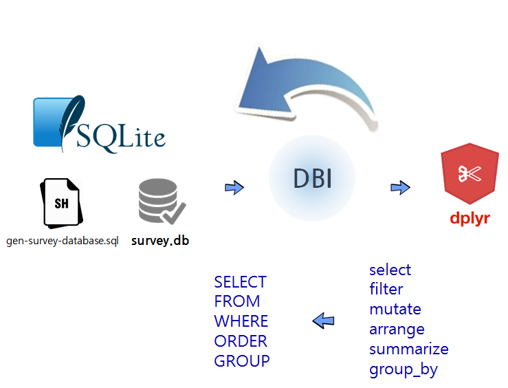

```{r setup, include=FALSE}
knitr::opts_chunk$set(echo = TRUE)
```


``` {r, include=FALSE}
library(DBI)
library(tidyverse)
```


## R에서 바라본 SQL

*SQL*에 대한 이해를 바탕으로 하여 
데이터 조작(Data Manipulation)의 기본을 잡고 더 나아가 `DBI` 팩키지를 통해 `dplyr`을 연결하여 그대로 활용하는 방안을
살펴보자.



R 개발자가 데이터를 분석할 때 데이터분석은 `dplyr`을 사용하고, 데이터베이스에 붙어 데이터 작업을 할 때는 `SQL`을 사용하는 것이 
관례로 오랜동안 사용되어온 작업흐름이다. 하지만, 좀더 곰곰히 생각해 보면 왜 동일한 작업을 두번 중복해서 할까?
이런 불편함에 대해 `dplyr`을 `DBI`, `odbc`와 붙여 사용하게 되면 `dplyr` 동사를 직접 사용해서 SQL 작업을 할 수 있다.
중간 통역이 제공되어 온전히 `dplyr` 동사를 데이터베이스에 던지면 작업이 가능하게 되었다.

#### SQL 자료처리

``` {r sql-select, eval=FALSE}
# 칼럼과 행 선택
SELECT 칼럼명1, 칼럼명2....칼럼명N
FROM   테이블명
WHERE  조건;

# 그룹에 따른 정렬 및 집합(aggregation)
SELECT SUM(칼럼명)
FROM   테이블명
WHERE  조건
ORDER BY 칼럼명 {오름차순|내림차순};
GROUP BY 칼럼명;
```

## SQLite와 실습 데이터베이스


인터랙티브하게 학습을 수행하기 위해서는 [설치 방법](http://software-carpentry.org/v5/setup.html)에 언급된 SQLite 를 참조하여 설치하고, 
학습자가 선택한 위치에 "software_carpentry_sql" 디렉토리를 생성한다. 

``` {r create-directory, eval=FALSE}
$ mkdir ~/swc/sql
```

생성한 디렉토리로 현재 작업 디렉토리를 변경한다.

``` {r change-directory, eval=FALSE}
$ cd ~/swc/sql
```

### SQLite 설치

[^install-sqlite3]: [SQLite3 설치 및 간단한 사용법](http://blog.simplism.kr/?p=2329)

[SQLite Download Page](http://sqlite.org/download.html)에서 [sqlite-tools-win32-x86-3200000.zip](http://sqlite.org/2017/sqlite-tools-win32-x86-3200000.zip)을 다운로드 받는다.
압축을 풀면 황당하게 몇개 `.exe` 파일이 존재하는 황당함을 느낀다. 설치가 완료되었다.

``` {r install-sqlite3-cmd, eval=FALSE}
$ ls
gen-survey-database.sql  sqlite3.exe           survey.db
sqldiff.exe              sqlite3_analyzer.exe
```

- sqlite3.exe: sqlite 실행파일
- gen-survey-database.sql: `survey.db` sqlite 데이터베이스를 생성시키는데 사용되는 스크립트
- survey.db: `sqlite3.exe` 명령어를 실행해서 `gen-survey-database.sql` 스크립트를 통해 생성된 데이터베이스


### 실습 예제 데이터베이스 다운로드 {#download-database}

`깃헙(GitHub)`에서 `gen-survey-database.sql` 파일을 어떻게 다운로드 받을까요?

`~/swc/sql` 디렉토리로 이동한 후에 그 디렉토리에서 
GitHub 사이트 [https://github.com/swcarpentry/bc/blob/master/novice/sql/gen-survey-database.sqlSQL](https://github.com/swcarpentry/bc/blob/master/novice/sql/gen-survey-database.sqlSQL)에 
위치한 SQL 파일("gen-survey-database.sql")을 다운로드한다.


`Wget` 혹은 `cURL`을 로컬에 설치한 후에, 터미널에서 다음 명령어를 실행한다.

**Tip:** 만약 cURL을 선호한다면, 다음 명령문에서 "wget"을 `curl -O`로 대체하세요.

``` {r download-survey-db, eval=FALSE}
root@hangul:~/swc/sql$ wget https://raw.githubusercontent.com/swcarpentry/bc/master/novice/sql/gen-survey-database.sql
```


성공적으로 완료되면 터미널은 다음 출력결과를 화면에 표시한다.

``` {r download-output, eval=FALSE}
--2014-09-02 18:31:43--  https://raw.githubusercontent.com/swcarpentry/bc/master/novice/sql/gen-survey-database.sql
Resolving raw.githubusercontent.com (raw.githubusercontent.com)... 103.245.222.133
Connecting to raw.githubusercontent.com (raw.githubusercontent.com)|103.245.222.133|:443... connected.
HTTP request sent, awaiting response... 200 OK
Length: 3297 (3.2K) [text/plain]
Saving to: ‘gen-survey-database.sql’

100%[=========================================================================================================================&gt;] 3,297       --.-K/s   in 0.01s   

2014-09-02 18:31:45 (264 KB/s) - ‘gen-survey-database.sql’ saved [3297/3297]
```

이제 성공적으로 단일 SQL 파일을 가져와서, 
`survey.db` 데이터베이스를 생성하고 
`gen-survey-database.sql` 에 저장된 지시방법에 따라서 데이터를 채워넣는다.

명령-라인 터미널에서 SQLite3 프로그램을 호출하기 위해서, 다음 명령문을 실행한다.

``` {r create-survey-db, eval=FALSE}
root@hangul:~/swc/sql$ sqlite3 survey.db < gen-survey-database.sql
```

### SQLite DB 연결 및 설치 테스트 

생성된 데이터베이스에 연결하기 위해서, 데이터베이스를 생성한 디렉토리 안에서 SQLite를 시작한다. 

``` {r run-survey-db, eval=FALSE}
root@hangul:~/swc/sql$ sqlite3 survey.db
```

그리고 나서 SQLite 시작되고 `sqlite`로 명령-라인 프롬프트가 다음과 같이 변경되어 표시된다.


``` {r run-survey-db-output, eval=FALSE}
SQLite version 3.20.0 2017-08-01 13:24:15
Enter ".help" for usage hints.
Connected to a transient in-memory database.
Use ".open FILENAME" to reopen on a persistent database.
sqlite>  
```

다음 출력결과가 보여주듯이 `.databases` 명령문으로 소속된 데이터베이스 이름과 파일 목록을 확인한다.

``` {r check-database, eval=FALSE}
sqlite> .databases
seq  name             file                                                      
---  ---------------  ----------------------------------------------------------
0    main             ~/novice/sql/survey.db
```


다음과 같이 타이핑해서 필요한 "Person", "Survey", "Site" "Visited" 테이블이 존재하는 것을 확인한다.
`.table`의 출력결과는 다음과 같다.

``` {r check-tables, eval=FALSE}
sqlite> .tables
Person   Site     Survey   Visited
```

## `dplyr` 동사 활용한 데이터베이스 작업 

### 데이터베이스 연결 

가장 먼저 앞에서 생성한 sqlite3 데이터베이스에 R과 연결시킨다. 
그리고 연결된 데이터베이스에 들어있는 테이블을 살펴본다.

``` {r connect-to-database, eval=FALSE}
# 0. 환경설정 -----------------------

# library(DBI)
# library(tidyverse)

# 1. 데이터 연결 -----------------------

con <- dbConnect(RSQLite::SQLite(), "data/survey.db")
dbListTables(con)
```

### SQL을 직접 던지기

`dbGetQuery` 명령어를 통해 연결된 `con`을 통해 데이터베이스에 질의문(query)를 직접 던질 수 있다.

``` {r sql-query, eval=FALSE}
# 2. SQL 활용 -----------------------
dbGetQuery(con, 'SELECT * FROM Person LIMIT 5')
```

### dplyr 동사 활용

`tbl` 함수로 `con` 으로 연결된 데이터베이스의 특정 테이블 "Survey"를 뽑아낸다.

``` {r extract-table, eval=FALSE}
# 3. dplyr 방식 -----------------------

survey_df <- tbl(con, "Survey")
head(survey_df)
```

### 데이터프레임 변환 

`tbl` 함수로 `con` 으로 연결된 데이터베이스의 특정 테이블 "Survey"를 뽑아낸 상태는 아직
R에서 작업이 가능한 데이터프레임이 아니라 `collect` 함수를 활용해서 데이터프레임으로 변환시켜 
후속 작업을 R에서 실행한다.

``` {r convert-to-dataframe, eval=FALSE}
# 4. 데이터프레임 변환 -----------------------

survey_df %>% collect() %>% 
    ggplot(aes(x= quant, y=reading)) +
    geom_boxplot()
```

### SQL 변환 과정 살펴보기

`show_query` 함수를 사용해서 `dplyr` 동사가 SQL 질의문으로 변환된 상황을 살펴볼 수도 있다.

``` {r show-query, eval=FALSE}
# 5. 내부 SQL 변환과정 살펴보기 --------------

show_query({
    survey_df %>% filter(quant == "sal")
})
```

###  데이터베이스 연결 끊기

데이터베이스는 혼자 사용하는 것이 아니라 사용하지 않는 경우 필히 연결시켜 놓은 `con`을 반듯이 끊어 놓는다.

``` {r db-disconnect, eval=FALSE}
# 7. 연결 끊기 -----------------------

dbDisconnect(con)
```


## dplyr and sql

### 1. 속도와 저장공간

[^duke-dplyr-sql]: [dplyr and SQL](http://www2.stat.duke.edu/~cr173/Sta523_Fa14/dplyr_sql.html)

구글 제프딘이 모든 엔지니어가 알아야 되는 속도[^jeff-dean-number]에 대해 언급한 내용을 정리하면 다음과 같다.

[^jeff-dean-number]: [Numbers everyone should know](http://surana.wordpress.com/2009/01/01/numbers-everyone-should-know/)

|      작업             |   소요 시간                   |
|-----------------------|:-----------------------------:|
| L1 캐쉬 참조          |	0.5 ns                      |
| L2 캐쉬 참조          |     7 ns                      |
| 주기억장치 참조       |   100 ns                      |
| 주기억장치에서 1 MB 순차적 읽어 오기 | 250,000 ns     |
| 디스크 검색           | 10,000,000 ns                 |
| 네트워크에서 1 MB 순차적 읽어 오기 |  10,000,000 ns   |

$10 GB$ 텍스트 파일이 있는 경우 전체 데이터를 순차적으로 불러 읽어들이는 경우 소요되는 시간은 다음과 같다.

- 파일을 메모리로 올리는 경우 소요 시간
    - $10 GB \times (250 \mu s / 1 MB) = 0.25초$
- 디스크에서 파일에 접근하는데 필요한 소요 시간     
    - $10 GB \times (250 \mu s / 1 MB) = 30초$


만약 $100 GB$ 크기 데이터 파일이 있는 경우는 다음과 같다.

- 파일을 메모리로 올리는 경우 소요 시간
    - $100 GB \times (250 \mu s / 1 MB) = 2.5초$
- 디스크에서 파일에 접근하는데 필요한 소요 시간     
    - $100 GB \times (250 \mu s / 1 MB) = 300초$

일반적으로 메모리 비용이 훨씬 디스크 비용보다 비싼 반면에, 속도는 메모리가 디스크에 비해 훨씬 빠른다.
데이터가 커지게 되면 메모리를 크게하면 되지만, 메모리는 한정되어 확장성에 문제가 있다.

이에 대한 해법이 **블록(block)**을 생성하는 것인데 아이디어는 유사한 속성을 갖는 행을 집단으로 묶어
한번에 다수 행을 불러 읽어들이는 것이다. 이런 경우 최적 크기를 결정해야 되는데 풀고자 하는 문제에 따라 
최적 크기를 결정하면 된다.


### 2. 공공 데이터를 `dplyr`과 SQLite 데이터베이스로 작업 

[교통위반(Traffic Violations)](https://catalog.data.gov/dataset?res_format=JSON) 데이터를 `read_csv` 함수로 불러읽어 온다.
데이터프레임으로 불러읽어들이면 행이 826,934, 열이 35개가 되고 366 MB가 된다.
저장공간도 문제가 되고 나중에 작업을 위해 바이너리로 압축하여 저장하면 $\frac{1}{10}$ 이상 크기가 줄어 27 MB까지 줄일 수 있다.


``` {r dplyr-import, eval=FALSE}
#-----------------------------------------------------------------------------------------
# 01. 환경설정
#-----------------------------------------------------------------------------------------
library(readr)
library(dplyr)
library(RSQLite)

#-----------------------------------------------------------------------------------------
# 02. 빅데이터 가져오기 및 데이터베이스 연결
#-----------------------------------------------------------------------------------------
# https://catalog.data.gov/dataset?res_format=JSON
park <- read_csv("https://data.montgomerycountymd.gov/api/views/4mse-ku6q/rows.csv?accessType=DOWNLOAD")
dim(park)
# [1] 826934     35

saveRDS(park, "./03.data/park.rds")
```

`dplyr`에서 데이터베이스에 연결하는 경우 `src_sqlite()`, `src_mysql()`, `src_postgres()`, `src_bigquery()`를 
사용한다. 이렇게 생성된 객체는 내부에 데이터가 전혀없는 깡통이다.
데이터가 크지 않는 경우 `copy_to` 명령어를 사용해서 마치 R 데이터프레임처럼 원데이터베이스에서 R로 데이터를 흘린다.

``` {r dplyr-sqlite, eval=FALSE}
# SQLite 데이터베이스에 연결
dir.create("./03.data/db",showWarnings = FALSE)
db <- src_sqlite("./03.data/park_db.sqlite3", create = TRUE)
dir("./03.data/")

# SQLite 데이터베이스를 R로 가져옮
park_sqlite  <- copy_to(db, park, temporary = FALSE)
park_sqlite
```

`tbl(db, sql("SELECT * FROM park LIMIT 10"))` 와 같이 `db` 연결에 `sql()` 인자를 넣어 직접 SQL
질의문을 실행시키는 것도 가능하다.

``` {r dplyr-sqlite-sql, eval=FALSE}
#-----------------------------------------------------------------------------------------
# 03. SQL 쿼리문 작성
#-----------------------------------------------------------------------------------------
# 1. SQL 문장을 바로 전달가능

tbl(db, sql("SELECT * FROM park LIMIT 10"))
# Source:   query [?? x 35]
# Database: sqlite 3.8.6 [./03.data/park_db.sqlite3]
# 
# `Date Of Stop` `Time Of Stop` Agency                SubAgency
# <chr>          <dbl>  <chr>                    <chr>
# 1      09/30/2014          85860    MCP  1st district, Rockville
# 2      03/31/2015          86340    MCP   2nd district, Bethesda
# 3      09/30/2014          84600    MCP 5th district, Germantown
# 4      03/31/2015          86340    MCP 5th district, Germantown
# 5      03/31/2015          86280    MCP   2nd district, Bethesda
# 6      03/31/2015          86280    MCP    4th district, Wheaton
# 7      03/31/2015          86280    MCP    4th district, Wheaton
# 8      03/31/2015          86280    MCP    4th district, Wheaton
# 9      03/31/2015          86280    MCP    4th district, Wheaton
# 10     03/31/2015          86280    MCP    4th district, Wheaton
# # ... with more rows, and 31 more variables: Description <chr>, Location <chr>, Latitude <dbl>, Longitude <dbl>, Accident <chr>, Belts <chr>,
# #   `Personal Injury` <chr>, `Property Damage` <chr>, Fatal <chr>, `Commercial License` <chr>, HAZMAT <chr>, `Commercial Vehicle` <chr>,
# #   Alcohol <chr>, `Work Zone` <chr>, State <chr>, VehicleType <chr>, Year <int>, Make <chr>, Model <chr>, Color <chr>, `Violation Type` <chr>,
# #   Charge <chr>, Article <chr>, `Contributed To Accident` <chr>, Race <chr>, Gender <chr>, `Driver City` <chr>, `Driver State` <chr>, `DL
# #   State` <chr>, `Arrest Type` <chr>, Geolocation <chr>

`dplyr` 동사를 순차적으로 적용시킬 경우 지연연산이 적용되어 바로 실행되지 않고,
`collect`를 실행할 경우 한방에 실행된다. 결국 최종 질의문 혹은 `dplyr` 동사들이 완성되면
`collect()`를 사용하여 데이터베이스에서 데이터를 쭉 끌어내서 `tble_df()`을 생성시키는 작업흐름을 갖추게 된다.


``` {r dplyr-sqlite-lazyeval, eval=FALSE}
# 2. dplyr 동사를 순차적으로 적용하여 한방에 실행

select_sql <- dplyr::select(park_sqlite, Agency, Accident, Belts, Geolocation) 
filter_sql <- dplyr::filter(select_sql, Accident=="No" & Belts =="No")
arrange_sql <- dplyr::arrange(filter_sql, Agency)
collect(arrange_sql)

# # A tibble: 7,410 × 5
# Agency Accident Belts                           Geolocation `Personal Injury`
# <chr>    <chr> <chr>                                 <chr>             <chr>
# 1     MCP       No    No (39.1893121333333, -77.1204492666667)               Yes
# 2     MCP       No    No (39.0471816666667, -77.0506783333333)               Yes
# 3     MCP       No    No (39.0471816666667, -77.0506783333333)               Yes
# 4     MCP       No    No (39.0471816666667, -77.0506783333333)               Yes
# 5     MCP       No    No         (39.0184883333333, -77.01448)               Yes
# 6     MCP       No    No                                  <NA>               Yes
# 7     MCP       No    No                                  <NA>               Yes
# 8     MCP       No    No                                  <NA>               Yes
# 9     MCP       No    No (38.9879983333333, -77.0273733333333)               Yes
# 10    MCP       No    No (38.9879983333333, -77.0273733333333)               Yes
# # ... with 7,400 more rows
```

