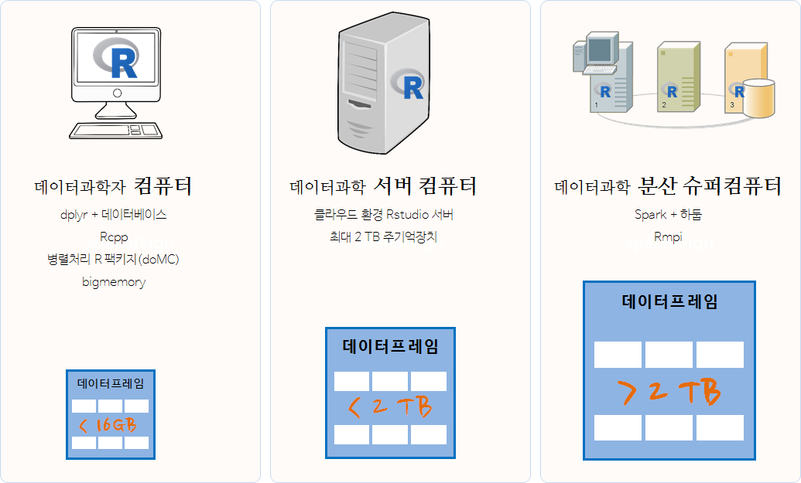
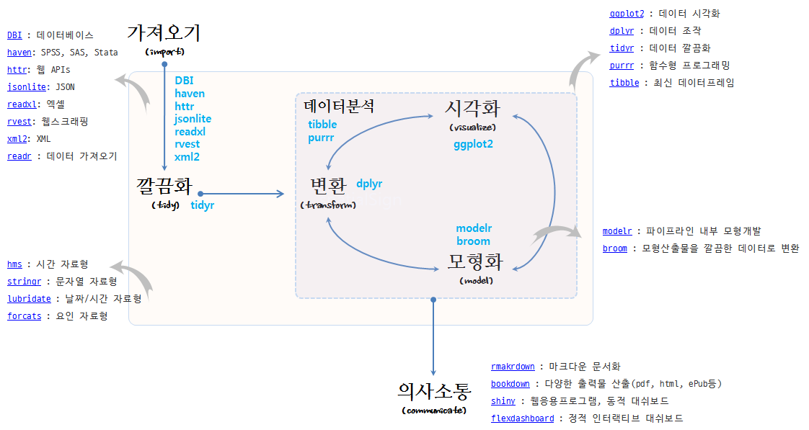
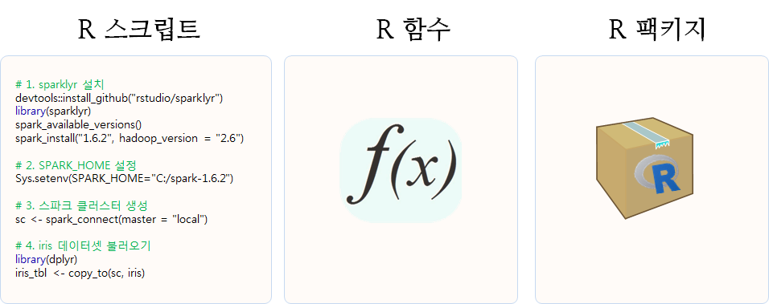
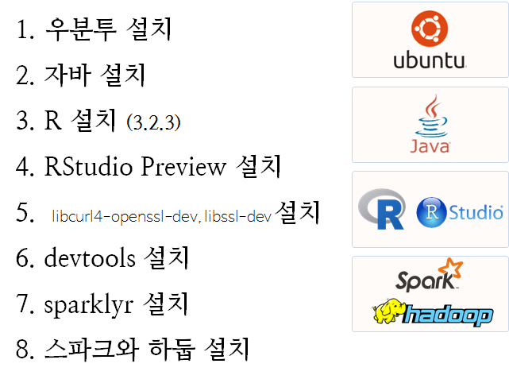

```{r setup, include=FALSE}
knitr::opts_chunk$set(echo = TRUE)
```


## 빅데이터 - tidyverse 스파크

> ## 학습 목표 {.objectives}
> * 대용량 빅데이터를 `tidyverse` 툴체인, 스파크, 함수형 프로그래밍으로 해결한다.

### 기계중심 빅데이터 문제 정의 및 처리 전략

|       구분     |               데이터 크기                                     |
|----------------|---------------------------------------------------------------|
| 매우 큰 데이터 | 컴퓨터 한대 메모리에 저장될 수 없는 크기 : **5 TB이상**          |
| 중간 데이터    | 서버 컴퓨터 메모리에 저장할 수 있는 크기 : **10 GB -- 5 TB**  |
| 작은 데이터    | 노트북 컴퓨터 메모리에 저장할 수 있는 크기 : **10 GB 이하**       |


* **빅데이터 처리 전략**
    1. 빅데이터 문제 소규모 분석방법(Big Data-Small Analytics) : 요약/표본추출/부분집합 추출 (90%) 
        * `sparklyr` 혹은 `SparkR`은 필요없다.
    1. 병렬처리가 가능한 문제: 작은 데이터 문제로 쪼개서 분할 정복 (9%)
        * `sparklyr` 혹은 `SparkR`을 사용해도 되지만, 공유메모리 병렬프로그램 `parallel`, `foreach` 혹은 메시지 전달 분산 병렬컴퓨팅 `Rmpi`도 대안이 된다.
    1. 빅데이터 문제 대규모 분석방법(Big Data-Large Scale Analytics): 더이상 어찌할 수 없는 큰 문제 데이터 (1%)
        * `sparklyr` 혹은 `SparkR`이 이런 문제에는 적합하다. 
        
 

### `tidyverse` 스파크 데이터 과학 개요.

- 16 GB 미만의 노트북 혹은 데스크톱 컴퓨터에서 `dplyr` + RDBMS를 설치해서 멀티코어 CPU를 활용하여 
병렬 컴퓨팅을 실행하는 것이 가장 작은 규모의 빅데이터 혹은 스몰데이터를 처리하는 방식이다.
- 2 TB까지 크기를 갖는 데이터를 처리하는데 클라우드 환경에 2TB 주기억장치를 갖는 가상컴퓨터를 생성하여 분석하는 것도 가능한
방법이다.
- 2 TB이상 크기를 갖는 데이터를 처리하는데 스파크+하둡 클러스터를 구축하여 분산처리하는 방식이 가장 많이 사용되는 최근의 추세다.



#### R 팩키지 도구상자 -- `tidyverse`



#### R 코드

처음에는 탐색적 자료분석과 임의 데이터 분석으로 R 스크립트가 생성된다. 
작업이 지속적으로 반복되거나, 4번이상 반복되는 것이 느껴질 때 함수를 작성할 시점이 되었다.
특정 작업에 지속적으로 함수가 늘어나고, 이를 조합하여 좀더 복잡한 문제를 해결할 필요성이 느껴질 때가
팩키지를 작성할 시점이 된 것이다. 
R 팩키지는 함수에 대한 단위테스트(`testthat`)와 함수 도움말과 가장 중요한 함수가 포함되어 있다.
물론 어떤 R 팩키지도 독립적으로 존재하지 않기 때문에, 네임스페이스를 통해 팩키지에 대한 의존성 정보도 함께
포함되게 된다.



### R 스파크 클러스터 설치 

진정한 분산처리를 위해서 클라우드나 자체 IDC 내부에 설치해야 맞다. 
하지만, 멀티코어와 충분한 주기억장치를 갖는 노트북이나 데스크탑 PC를 보유한 경우 직접 스파크 클러스터를 설치하는 것도 좋다.

1. 우분투 설치
1. 자바 설치
1. R 설치 (3.2.3)
1. RStudio Preview 설치
1. `libcurl4-openssl-dev`, `libssl-dev` 설치: `devtools` 의존성
1. devtools 설치
1. sparklyr 설치
1. 스파크와 하둡 설치



데이터과학에서 재현성이 무척이나 중요한 요소다. 우분투 16.04. 이미지를 기반으로 R 스파크 클러스터를 생성한다.
우분투 16.04 LTS 버젼을 기반으로 설치를 한 뒤에 자바를 설치한다. 우분투 터미널을 열고 다음과 같은 순서대로 `openjdk`를 설치한다.

``` {r, eval=FALSE}
$ sudo add-apt-repository ppa:openjdk-r/ppa
$ sudo apt-get update
$ sudo apt-get install -y openjdk-8-jdk
```

R을 설치한 뒤에 [`RStudio Preview`](https://www.rstudio.com/products/rstudio/download/preview/)를 설치하면, 
스파크와 하둡 설치에 필요한 사항을 상당부분 자동으로 알아서 해준다.

> ### `sparklyr`로 설치하면 좋은 점 {.callout}
> 
> 윈도우 환경에서 하둡을 돌리기 위해서는 [Hadoop winutils](https://github.com/steveloughran/winutils), 즉 
> `winutils.exe` 파일을 특정 폴더 예를 들면, `C:\spark-1.6.2-bin-hadoop2.6\tmp\hadoop\bin` 복사해서 넣어야 된다.
> 그 외에도 `C:\Users\<USERNAME>\AppData\Local\rstudio\spark\Cache\spark-1.6.2-bin-hadoop2.6\bin\` 권한 설정을 별도로 해줘야 하는
> 문제도 해결해야 된다. [^sparklyr-windows-install]

[^sparklyr-windows-install]: [运行Apache星火与sparklyr和R在Windows](http://yokekeong.com/running-apache-spark-with-sparklyr-and-r-in-windows/)

`sparklyr`을 설치하기 위해서는 `devtools`가 필요하고, `devtools`가 잘 설치되기 위해서는 `libcurl4-openssl-dev`, `libssl-dev`을
배쉬쉘에서 설치해야 된다. 

``` {r, eval=FALSE}
$ sudo apt-get install libcurl4-openssl-dev libssl-dev
```

이런 과정을 거치게 되면 `RStudio` 통합개발환경을 띄울 준비가 되었다. 이제 RStudio 화면에서 다음과 같은 명령어를 순차적으로
실행한다.

``` {r, eval=FALSE}
install.packages("devtools", dependencies = TRUE)
devtools::install_github("hadley/devtools") # 최신 버젼을 원하는 경우 

# 1. sparklyr 설치
devtools::install_github("rstudio/sparklyr")
library(sparklyr)
spark_available_versions()
spark_install(version = "1.6.2", hadoop_version = "2.6")

# 2. 스파크 클러스터 생성
library(dplyr)
sc <- spark_connect(master = "local")

# 3. iris 데이터셋 불러오기ibrary(dplyr)
iris_tbl <- copy_to(sc, iris)
```

`sc` 스파크 컨텍스트가 생성되면 `iris` R 데이터프레임을 `copy_to` 명령어로 스파크 데이터프레임 
`iris_tbl`로 생성하면 스파크 클러스터에서 데이터를 분석할 준비를 마치게 된다.


## 대용량 데이터 표본추출

### 1. 압축파일 풀기

맥 기준으로 설명하면 p7zip 전용 프로그램을 통해 대용량 압축 파일을 푼다. 설치방법은 brew install p7zip을 터미널에서 실행한다. 7z x 압축파일명 명령어를 입력하면 압축파일이 풀려 원본 파일이 나타난다.

```
$ brew install p7zip
$ 7z x data_2016-10-05.zip 
~ $ ls -al
total 11236792
drwxr-xr-x+   59 stat.....  staff        2006 10 12 18:35 .
drwxr-xr-x     5 root       admin         170  1 15  2016 ..
-rwxrwxrwx     1 stat.....  staff  1169766972 10  7 20:21 data_2016-10-05.zip
-rw-r--r--     1 stat.....  staff  4578470987 10  5 23:18 players_result.txt
```

data_2016-10-05.zip 1.1 GB 압축파일을 풀게되면 4.5 GB 텍스트 파일로 생성된 것이 확인된다.

### 2. 표본추출 전략 수립

표본추출을 위한 작업을 위해서 먼저 전략을 잘 수립하여야 한다. 전체 파일에 대한 1% 임의추출을 목표로 삼고 표집하는 경우를 상정한다.

```
$ wc -l players_result.txt 
 174163238 players_result.txt
```

wc -l 명령어는 해당 파일에 행이 얼마나 되는지 알아내는 명령어다. 이를 통해서 1.7억줄이 있는 것이 확인된다. 이를 바탕으로 1% 임의추출할 경우 약 170만줄을 임의추출하면 된다.

### 3. 표본추출 툴설치 1

표본추출을 위해 설치해야 되는 도구는 기본적으로 sort, shuf, gshuf가 있다. 기능적인 면을 떠나 대용량 파일의 경우 성능 속도가 도구를 선택하는 중요한 요인이다.

백만줄을 seq -f 'line %.0f' 1000000 명령어로 생성하여 표집한 경우 성능이 가장 좋은 것은 다음과 같은 순으로 정렬된다.

shuf: 0.090 초
루비 2.0: 0.289 초
펄 5.18.2: 0.589 초
파이썬 : 1.342 초
awk + sort + cut: 3.003 초
sort -R : 10.661 초
스칼라: 24.229 초
배쉬 루프 + sort : 32.593초
따라서 shuf를 리눅스에서 gshuf를 맥에서 사용하면 최선의 성과를 얻을 수 있다.

gshuf가 맥의 경우 coreutils에 포함되어 있기 때문에 이를 설치해야 되는데, 이전에 brew link xz을 실행하고 바로 설치한다.

```
$ brew link xz
$ brew install coreutils
```

### 4. 1% 표본 추출

gshuf, shuf 명령어는 -n 인자로 추출할 행을 수를 지정하면 자동으로 추출해주는데, 결과를 리다이렉션하여 players_170000.txt 파일에 저장한다.

표본추출결과 데이터 크기를 1/1000, 1/10000 줄인 것이 확인된다.


```
$ gshuf -n 17000 players_result.txt > players_17000.txt 
$ gshuf -n 170000 players_result.txt > players_170000.txt 
$ ls -al
total 11236792
drwxr-xr-x+   59 stat.....  staff        2006 10 12 18:35 .
drwxr-xr-x     5 root       admin         170  1 15  2016 ..
-rwxrwxrwx     1 stat.....  staff  1169766972 10  7 20:21 data_2016-10-05.zip
-rw-r--r--     1 stat.....  staff      447091 10 12 18:35 players_17000.txt
-rw-r--r--     1 stat.....  staff     4468179 10 12 18:35 players_170000.txt
-rw-r--r--     1 stat.....  staff  4578470987 10  5 23:18 players_result.txt
```


## 데이터테이블 분석

> ## 학습 목표 {.objectives}
> * dplyr 과 hflights 팩키지 [^data-camp-dplyr]

### 데이터 분석 시작

`dplyr`, `hflights` 팩키지를 불러와서 `head`와 `summary` 명령어로 데이터를 살펴본다.

``` {r message=FALSE, warning=FALSE, comment=FALSE}
library(dplyr)
library(hflights)
head(hflights)
summary(hflights)
```

### 데이터프레임을 데이터테이블로 변환

`tbl_df` 함수를 사용해서 데이터프레임(data.frame)을 데이터테이블(data.table)로 변환한다. 


``` {r message=FALSE, warning=FALSE, comment=FALSE}
hflights <- tbl_df(hflights)

hflights

carriers <- hflights$UniqueCarrier
```

### 변수값 재부호화(recoding)

데이터 작업 중에 가장 많이 수행하는 작업 중 하나가 변수내부 값을 다른 값으로 재부호화하는 것이다.
예를 들어, `남자`를 `Male`, `여자`를 `Female`처럼 한국어를 영어로 재부호화하거나,
`KO`를 `한국`, `CN`을 `중국`처럼 코드화된 것을 개발자가 이해하기 새롭게 재부호화하는 것이다.
`car` 라이브러리 `recode` 함수 등 다양한 재부호화 함수가 존재한다. 

데이터프레임의 재부호화하는 방법을 살펴보자. 초간략 코드화된 항공사 코드를 개발자가 이해하기 쉬운
코드로 바꿔보자.

``` {r message=FALSE, warning=FALSE, comment=FALSE}
lut <- c("AA" = "American", "AS" = "Alaska", "B6" = "JetBlue", "CO" = "Continental", 
         "DL" = "Delta", "OO" = "SkyWest", "UA" = "United", "US" = "US_Airways", 
         "WN" = "Southwest", "EV" = "Atlantic_Southeast", "F9" = "Frontier", 
         "FL" = "AirTran", "MQ" = "American_Eagle", "XE" = "ExpressJet", "YV" = "Mesa")
hflights$UniqueCarrier <- lut[hflights$UniqueCarrier]         
glimpse(hflights)
```

결과를 일별하는데 `glimpse` 함수가 요긴하게 사용될 수 있다.
또다른 사례로 운항취소 코드를 개발자가 이애하기 쉬운 코드로 재부호화해보자.

``` {r message=FALSE, warning=FALSE, comment=FALSE}
lut = c("A"="carrier", "B"="weather", "C"="FFA", "D"="security","E"="not cancelled")

hflights$CancellationCode <- lut[hflights$CancellationCode]

glimpse(hflights)
```


[^data-camp-dplyr]: [Data Manipulation in R with dplyr](https://www.datacamp.com/courses/dplyr-data-manipulation-r-tutorial)
