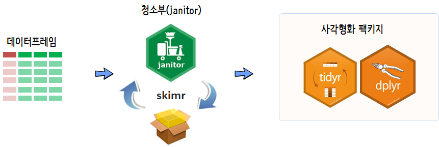

```{r setup, include=FALSE}
knitr::opts_chunk$set(echo = TRUE)
```


## 데이터 전처리

원본데이터를 `readr` 팩키지 다양한 함수로 가져오면 가장 먼저하는 역할이 데이터를 길들이는 것이다.
모형과 시각화를 위해서 **데이터 사각형화(data rectangling)** 이전에 데이터 전처리가 수반되고,
데이터 전처리는 **데이터 정제작업(cleaning)**과 함께 **데이터 길들이기(taming)**를 포함한다.

이를 위해서 [청소부(janitor)](https://github.com/sfirke/janitor) 팩키지와 `skimr`이 동원되고, 
`tidyr`, `dplyr`가 필수적인 연장이 된다.



### 데이터 청소부 

## 변수명 {#data-janitor-preprocess-varname}

과거 `make.names()` 함수로 난잡한 변수명 문제를 처리했다면, 
이제 `clean_names()` 함수로 변수명 문제를 깔끔하게 정리할 수 있다.

<div class = "row">
  <div class = "col-md-6">

**난감한 상황**

``` {r data-janitor-preprocess-varname}
# 0. 환경설정 -----
library(janitor)
library(tidyverse)

# browseVignettes(package="janitor")

# 1. 변수명 -----
test_df <- as.data.frame(matrix(ncol = 6))
names(test_df) <- c("hIgHlo", "REPEAT VALUE", "REPEAT VALUE", "% successful (2009)",  "abc@!*", "")

test_df
```

  </div>
  <div class = "col-md-6">

**청수부 동원**

``` {r data-janitor-preprocess-varname-new}
# make.names

test_df %>% 
    clean_names()
```


  </div>
</div>


## 중복행(row) - 중복제거 {#data-janitor-preprocess-dedup}

`get_dedups()` 함수로 중복되는 행을 빠를게 찾아내서 검출할 수 있다.

``` {r data-janitor-preprocess-dedup}
# 2. 중복행(row): dedup rows -----
mtcars %>% 
    get_dupes(wt, cyl)
```

## 표 {#data-janitor-preprocess-table}

범주형 데이터를 살펴보기 위해서 표를 많이 사용한다. 
하지만, `table()` 함수로 데이터를 살펴보면 난감하기 그지없다.

``` {r data-janitor-preprocess-table}
# 3. 표 데이터 -----
table(mtcars$gear, mtcars$cyl)
```

이를 타계하기 위해서 `tabyl()` 함수를 사용하고 다양한 꾸미기 동사를 동원해서 
표를 생성시킬 수 있다. 행중심과 열중심으로 데이터프레임을 표형식 데이터프레임으로 변환시킨다.

<div class = "row">
  <div class = "col-md-6">

**열중심 표**

``` {r data-janitor-preprocess-table-col, eval=FALSE}
mtcars %>%
    tabyl(gear, cyl) %>%
    adorn_totals("col") %>%
    adorn_percentages("row") %>%
    adorn_pct_formatting(digits = 2) %>%
    adorn_ns() %>% 
    DT::datatable(rownames = FALSE)
```

  </div>
  <div class = "col-md-6">

**행중심 표**

``` {r data-janitor-preprocess-table-row, eval=FALSE}
mtcars %>%
    tabyl(gear, cyl) %>%
    adorn_totals("row") %>%
    adorn_percentages("col") %>%
    adorn_pct_formatting(digits = 2) %>%
    adorn_ns() %>% 
    DT::datatable(rownames = FALSE)
```


  </div>
</div>


### 단변량 표 {#data-janitor-preprocess-table-univariate}

앞서 맞보기한 `tabyl()` 함수를 단변량인 경우 파이프 연산자를 동원하여 빈도수와 비율을 계산한다.

``` {r data-janitor-preprocess-table-univariate, eval=FALSE}
## 3.1. 단변량 표 -----
humans <- starwars %>%
    filter(species == "Human")

humans %>%
    tabyl(eye_color) %>% 
    adorn_totals("row") %>%