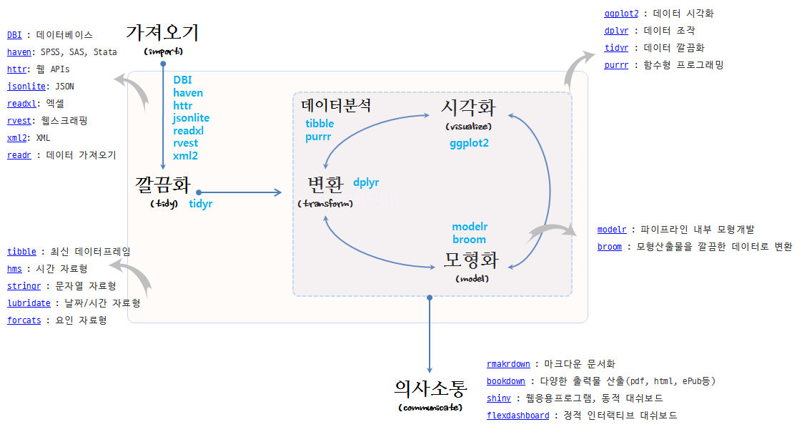
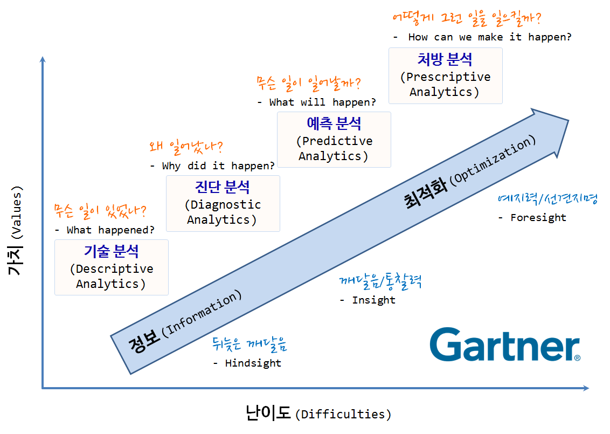
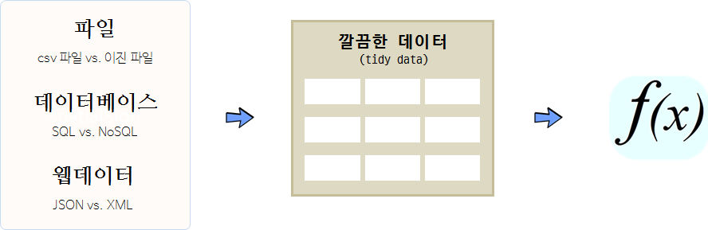

```{r setup, include=FALSE}
knitr::opts_chunk$set(echo = TRUE)
```


## tidyverse R 데이터 과학 기본체계

1. 데이터 과학 문제정의

데이터 정제(Cleansing)는 원데이터를 시각화하거나 모형을 개발을 위해 다음 단계를 준비하는 사전 준비과정이다. 
하지만, 데이터 정제는 과거 많이 사용된 개념으로 정형화된 데이터베이스 혹은 통계 팩키지에 데이터를 사전 준비하는 과정을 
지칭하는 것으로 비정형 데이터와 정형 데이터가 함께 공존하고, 새로운 유형의 데이터가 넘처나는 지금에는 데이터 랭글링(Data Wrangling) 혹은 데이터 먼징(Data Munging)같은 용어가 사용된다.

목표는 원자료(raw data)를 또다른 형태로 수작업 혹은 자동화하는 프로그램을 작성하여 전환하거나 매핑하는 과정이다.
[데이터 과학자에 관한 하바드 비즈니스 리뷰 기사](https://hbr.org/2012/10/data-scientist-the-sexiest-job-of-the-21st-century/)[^data-science-hbr]에 따르면, 21세기 가장 인기있는 직업이 데이터 과학자로 친송받고 있지만, **[데이터 랭글링에 관한 뉴욕타임즈 기사](http://www.nytimes.com/2014/08/18/technology/for-big-data-scientists-hurdle-to-insights-is-janitor-work.html?_r=0)**[^data-science-nytimes]에 따르면 데이터 과학자 시간의 50% ~ 80% 시간을 데이터를 수집, 준비, 정제 등의 노동집약적인 작업에 소모하는 것으로 보고되고 있다. 

이런 문제에 대한 해결책을 오랜 기간동안 탐구해 왔지만, 문제의 본질을 파악하고 이에 대한 적절한 툴체인을 구축함으로써 
문제를 기회를 바꿀 수 있다.


데이터 과학은 컴퓨터와 사람이 데이터 프로그래밍 언어 R로 소통하는 과정으로 이해할 수 있다.
사람이 인지하여 생각한 것을 코딩을 통해 기술하고 이를 컴퓨터에 넣어주면, 컴퓨터가 이를 실행하는 과정이다.
과거, 컴퓨터 자원이 희귀하여 최대한 컴퓨터을 활용하는 점에 초점을 맞춰 데이터 과학 아키텍처가 설계되었다면,
현재는 클라우드, 오픈소스, 오픈 데이터, 인터넷에 연결된 수많은 컴퓨터로 말미암아 
사람이 가장 중요한 자원이 되었고, 컴퓨터에 작업명령을 기술하는 코딩도 기계중심 프로그래밍 언어에서
인간중심 프로그래밍 언어로 진화하고 있다.

## 2. 문제해결 개념 아키텍쳐

문제 해결의 중심에 사람이 있다. 하지만 `tidyr`을 통해 데이터테이블 형식의 
데이터가 `dplyr`에 들어오는 것을 기본 가정으로 깔고 있다.
데이터테이블로 데이터가 들어오면 데이터를 처리하는 인지능력을 통해
알고리즘을 생각하고, 이를 코딩으로 기술해서,
컴퓨터에 작업명령을 내린다.


### 2.1. `dplyr` 동사 명령어

인지능력을 통해 데이터를 처리하는 알고리즘은 데이터 처리 동사 명령어로 볼 수 있다.
`tidyr`을 통해 정규데이터 형태로 변형이 되었다고 가정하면,
변수에 연산작업을 내리는 `select()`, 행에 연산작업을 지시하는 `filter()`,
변수 변환과정을 통해 신규 변수를 생성하게 만드는 `mutate()`,
평균, 합, 분산, 최대값 등 관측점을 요약하는 `summarise()`,
변수에 관측점을 오름차순 혹은 내림차순으로 정렬하는 `arrange()` 함수가 있고,
추가로 `group_by()` 함수로 그룹집단을 지정한다.

- select: 데이터테이블에서 변수를 뽑아낸다.
- filter: 값으로 관측점을 뽑아낸다.
- mutate: 신규 변수를 생성한다. (log 변환)
- summarise: 관측점을 하나로 축약한다. (평균)
- arrange: 관측점을 오름차순, 내림차순으로 정렬한다.

### 2.2. `%>%` 파이프라인 연산자

`dplyr`은 파이프 연산자 [magrittr](https://cran.r-project.org/web/packages/magrittr/vignettes/magrittr.html)을 가져와서 사용한다. 
`%>%`은 "then"으로, 혹은 "파이프" 발음한다.


> ### 전통적 R 코드와 파이프 연산자를 사용한 R 코드 비교 {.callout}
>
> #### 전통적 R 코드
> ~~~ {.input}
> hourly_delay <- filter(   
>    summarise(   
>        group_by(   
>             filter(   
>                 flights,    
>                 !is.na(dep_delay)   
>             ),    
>             date, hour   
>        ),    
>    delay = mean(dep_delay),    
>         n = n()   
>    ),    
>    n > 10   
> )
> ~~~
>
> #### 파이프 연산자를 사용한 R 코드
> 
> ~~~ {.r}
> hourly_delay <- flights %>%  
>   filter(!is.na(dep_delay)) %>% 
>   group_by(date, hour) %>% 
>   summarise(delay = mean(dep_delay), n = n()) %>%  
>   filter(n > 10) 
> ~~~

### 2.3. SQL 코드 자동생성

`dplyr` 팩키지에 `translate_sql` 함수를 통해 R코드를 SQL 쿼리문으로 
바꿔 데이터베이스에 질의를 던지게 된다. 이를 통해 빅데이터 및 다양한 데이터베이스에 
존재하는 데이터를 R에서 인지적 부담없이 작업할 수 있게 된다.

``` {r dplyr-code, eval=FALSE}
flights %>%
 filter(!is.na(dep_delay)) %>%
 group_by(date, hour) %>%
 summarise(delay = mean(dep_delay), n = n()) %>%
 filter(n > 10)
}
```

``` {r sql-code, eval=FALSE}
SELECT "date", "hour", "delay", "n"
FROM (
    SELECT "date", "hour",
        AVG("dep_delay") AS "delay",
        COUNT() AS "n"
    FROM "flights"
    WHERE NOT("dep_delay" IS NULL)
    GROUP BY "date", "hour"
) AS "_W1"
WHERE "n" > 10.0
```

## 3. `tidyverse` 선언 [^tidyverse-menifesto]





`tidyverse`는 Hadley Wickham의 오랜 작업을 나름대로의 방식으로 집대성하여 데이터과학을 유사한 방식으로 
접근하고자 하는 데이터과학자 및 실무자에게 도움을 주고자 한다. 어떻게 보면 오픈소스 운동의 커다란 동력이 될 수도 있다.


[^tidyverse-menifesto]: [The tidy tools manifesto](https://cran.r-project.org/web/packages/tidyverse/)

R 언어 기반의 만개가 넘는 팩키지가 개발되어 활용되고 있으나, 각자의 설계원칙에 맞춰 제각기 개발되고 손을 바꿔 다른 사람들이 
오랜동안 이어 받아 진행되어 초기 세워진 설계원칙이 많이 무너진 것도 사실이다. 이에 `tidyverse`는 데이터과학에 
그동안 R 팩키지를 개발하면서 축척된 경험과 노하우를 기반으로 R 설계 원칙을 정립하고자 한다.

엉망진창인 R 도구상자(`messyverse`)와 비교하여 깔끔한 R 도구상자(`tidyverse`)는 깔끔한(tidy) API에 다음과 같은 4가지 원칙을 제시한다.

- 기존 자료구조를 재사용: Reuse existing data structures.
- 파이프 연산자로 간단한 함수를 조합: Compose simple functions with the pipe.
- 함수형 프로그래밍을 적극 사용: Embrace functional programming.
- 기계가 아닌 인간을 위한 설계: Design for humans.

시각화(Visualization)는 데이터에 대한 통찰력(insight)과 탄성, 놀라움을 줄 수 있지만, 확장성(Scalability)은 떨어진다. 
왜냐하면, 사람이 데이터 분석 루프에 포함되기 때문에 확장 및 자동화에 한계가 있다. 
반대로 모형(Model)은 자동화와 확장성에는 장점이 있지만, 주어진 모형틀안에서 이루어지기 때문에 통찰력, 놀라움, 탄성을 주지는 못하는 아쉬움이 있다. 

가능하면 기존 자료구조를 재사용한다. `ggplot2`, `dplyr`, `tidyr`을 포함한 대다수 R 팩키지는 칼럼에 변수, 행에 관측점을 갖는 
직사각형 형태 데이터셋을 가정한다.  그리고, 일부 팩키지는 특정한 변수 자료형에 집중한다. `stringr`은 문자열, `lubridate`는 날짜/시간,
`forcats`는 요인 자료형에 집중한다.

파이프 연산자로 간단한 함수를 조합하여 시스템 전체의 힘을 극대화한다. 복잡한 문제를 해결하는 강력한 전략은 단순한 많은 조각으로 나누고 
이를 조합하는 것이다. 단, 각 조각은 격리되어 쉽게 파악되고, 다른 조각과 조합할 수 있는 표준이 성립되어야 된다.
R에 파이프 연산자를 사용하여 본 전략이 구현되어 있다. `%>%` 연산자는 많은 팩키지에 두루 걸쳐 동작되는 일반적인 결합 방식으로 이를 위해 함수를 
작성할 때 다음 원칙을 갖고 작성한다.

- 함수를 가능하면 단순하게 작성한다. 일반적으로 각 함수는 한가지 작업을 매우 잘해야 되고, 한 문장으로 함수 존재목적을 기술할 수 있어야 된다.
- 변형(transformation)과 부작용(side-effect)을 뒤섞지 마라. 함수가 객체를 반환하거나, 부작용을 일으키거나 둘 중 하나만 동작하게 만든다.
- 함수명은 동사가 되어야 한다. 하지만, 예외로 대다수 함수가 동일한 동사를 사용한다. 예를 들어 `modify`, `add`, `compute` 등을 들 수 있다.
이런 경우 반복되는 동사가 중복되지 않도록 명사에 집중한다. `ggplot2`가 좋은 예가 되는데 기존 플롯에 좌표, 점, 범례등을 거의 모든 함수가 추가하기 때문이다. 

R은 함수형 언어라 객체지향언어나 다른 언어 패러다임과 싸우려고 하지 말고 받아들여라. 이것이 의미하는 바는 다음과 같다.

- 상태불변 객체: 작성된 코드에 대한 추론이 쉬움.
- S3, S4 에서 제공하는 제네릭 함수: 상태변형 가능한 상태가 필요하다면, 파이프 내부에서 구현. 
- for 루프를 추상화한 도구: `apply` 함수 가족과 `purrr` 맵함수

데이터과학에서 병목점으로 문제가 발생되는 곳은 공통적으로 컴퓨터 실행시간(computing time)이 아니라 사람의 생각(thinking time)의 시간이다.
따라서, 함수명을 작성할 때 생각이 잘 연상되는 이름을 작명하는데 시간을 적절히 안분하고, 명시적이고 긴 명칭을 변수명, 함수명, 
객체명에 사용하고, 짧은 명칭은 가장 중요한 이름으로 활용한다. RStudio 소스 편집기의 자동완성기능을 사용하는 경우 접두어가 접미어보다 중요하고,
`stringr`, `xml2`, `rvest` 팩키지를 살펴보면 접두어에 일관된 명칭을 부여한 장점을 알수 있다.


## 5. 가트너 데이터 과학


가트너가 제시한 데이터를 활용하는 4단계 즉, 기술분석, 진단분석, 예측분석, 처방분석 단계는 
데이터를 정보로서 활용하는 단계부터 최적화하는 단계까지 확장된다.

- 기술 분석(Descriptive Analytics): 무슨 일이 있었나? (What happened?)
- 진단 분석(Diagnostic Analytics): 왜 일어났나? (Why did it happen?)
- 예측 분석(Predictive Analytics): 무슨 일이 일어날까? (What will happen?)
- 처방 분석(Prescriptive Analytics): 어떻게 그런 일을 일으킬까? (How can we make it happen?)

이를 통해 뒤늦은 깨달음(Hindsight) 복기, 깨달음/통찰력(Insight), 예지력/선견지명(Foresight)을 얻을 수 있다.
가치도 크지만 그에 따른 어려움도 가중된다.




## 데이터분석을 위한 파이프라인


### 1. 데이터 분석 파이프라인

데이터 분석은 다른 소프트웨어 개발과 동일하게 **컴퓨터 시간(Computer time)**과 
**개발자 시간(Human time)**을 최적화하는 과정으로 볼 수 있다.
최근에 가장 희귀하고 귀중한 자원은 컴퓨터가 아니라 개발자 시간 즉, 사람이다.

따라서, 사람 시간을 최적화하는 것이 데이터 분석에서 가장 중요한 요소가 되면 그 해답이
**%>%** 즉, `magrittr` 팩키지에도 존재한다.
프랑스 액센트가 들어간 [magrittr](https://cran.r-project.org/web/packages/magrittr/) 팩키지는 
개발시간을 단축하고 코드 가독성을 높이고 유지보수성을 높이는 목적을 갖고 있다.
유닉스 쉘, `F#`, haskell, clojure, method chaining에서 영감을 받았다.



파일(`.csv`같은 일반 텍스트 파일, 엑셀같은 이진 파일) 형태, 데이터베이스(SQL, NoSQL) 형태,
웹데이터(JSON, XML) 형태로 존재하는 데이터를 가져와서 이를 분석에 적합한 형태, 즉 **깔끔한 데이터(tidy data)**로 
변환을 해야만 한다. 깔끔한 데이터는 기계도 잘 이해하고, 분석가도 잘 이해하는 형태가 되어야 한다.

|   기계 저장 방식   |     사람 이해 방식    |
|:------------------:|:---------------------:|
|   파일/테이블      |    데이터셋(Data set) |
|      행(row)       |   관측점(Observation) |
|    열(column)      |    변수(Variable)     |


#### 1.1. `magrittr` 코드와 일반 R 코드 비교 [^magrittr-vignette]

`mtcars` 데이터셋을 파이프를 통해 데이터를 깔끔하게 정리하는 것과 기존 전통적 방식으로 개발된 코드를 비교해 보자.

``` {r message=FALSE, warning=FALSE, comment=FALSE}
library(magrittr)

car_data <- 
  mtcars %>%
  subset(hp > 100) %>%
  aggregate(. ~ cyl, data = ., FUN = . %>% mean %>% round(2)) %>%
  transform(kpl = mpg %>% multiply_by(0.4251)) %>%
  print
```

전통적인 R코드는 본인이 작성하지 않았다면 해독하기가 만만치 않고, 괄호가 많다.

``` {r message=FALSE, warning=FALSE, comment=FALSE, results="hide"}
car_data <- 
  transform(aggregate(. ~ cyl, 
                      data = subset(mtcars, hp > 100), 
                      FUN = function(x) round(mean(x, 2))), 
            kpl = mpg*0.4251)
```

결국 읽기 어렵고 이해하기 힘든 함수 조합을 가독성 높은 순열(sequence)로 변환하는 역할을 한다.

``` {r message=FALSE, warning=FALSE, comment=FALSE, results="hide", eval=FALSE}
x %>% f(y)
# f(x, y)
x %>% f(z, .)
# f(z, x)
x %>% f(y) %>% g(z)
# g(f(x, y), z)
```

> ### 데이터 분석 정의 {.callout}
>
> 데이터 분석은 데이터가 이해되고, 지식이 되고, 통찰을 얻게 되는 과정이다.  
> 
> *"Data analysis is the process by which data becomes understanding, knowledge and insight"*    
>
> --- Hadley Wickham


#### 2.1. 깔끔한 데이터 -- `tidyr`

``` {r message=FALSE, warning=FALSE, comment=FALSE}
suppressMessages(suppressWarnings(library(tidyr)))
suppressMessages(suppressWarnings(library(readr)))
suppressMessages(suppressWarnings(library(dplyr, warn.conflicts = FALSE)))
suppressMessages(suppressWarnings(library(curl)))

# 데이터 가져오기
tb <- tbl_df(read_csv(url("https://raw.githubusercontent.com/hadley/tidyr/master/vignettes/tb.csv")))
tb

# 자료분석을 위한 형태로 변형한다.
tb2 <- tb %>%
  gather(demographic, n, m04:fu, na.rm = TRUE)
tb2

# 변수를 성별과 연령으로 쪼갠다.
tb3 <- tb2 %>%
  separate(demographic, c("sex", "age"), 1)
tb3

tb4 <- tb3 %>%
  rename(country = iso2) %>%
  arrange(country, year, sex, age)
tb4
```

#### 2.2. 변환 -- `dplyr`

- select: 데이터테이블에서 변수를 뽑아낸다.
- filter: 값으로 관측점을 뽑아낸다.
- mutate: 신규 변수를 생성한다. (log 변환)
- summarise: 관측점을 하나로 축약한다. (평균)
- arrange: 관측점을 오름차순, 내림차순으로 정렬한다.

### 2.3. 시각화 -- `ggvis`

- ggplot2
- shiny
- dplyr 파이프라인
- vega 

### 2.4. 모형 -- `broom`

모형은 알려진 패턴을 제거하는데 탁월하다.

``` {r message=FALSE, warning=FALSE, comment=FALSE, eval=FALSE}
suppressMessages(suppressWarnings(library(tidyr)))
suppressMessages(suppressWarnings(library(ggplot2)))
suppressMessages(suppressWarnings(library(broom)))

tx <- 
  readRDS("tx-housing.rds") %>%
  mutate(date = year + (month - 1) / 12) %>%
  filter(!(city %in% c("Texas Totals", "Palestine")))
tx

ggplot(tx, aes(date, log(sales))) + 
  geom_line(aes(group = city), alpha = 1/2)
ggsave("sales.pdf", width = 8, height = 6)

# Models as a tool --------------------------------------------------------
tx <- tx %>% 
  group_by(city) %>% 
  mutate(
    resid = 
      lm(log(sales) ~ factor(month), na.action = na.exclude) %>%
      resid()
  )

ggplot(tx, aes(date, resid)) +
  geom_line(aes(group = city), alpha = 1/5) + 
  geom_line(stat = "summary", fun.y = "mean", colour = "red")
```

### 5. 빅데이터 

| 구분  |  데이터 크기 |
|--------------|--------------|
| 매우 큰 데이터 | 컴퓨터 한대 메모리에 저장될 수 없는 크기 : **>5 TB** |
| 중간 데이터 | 서버 컴퓨터 메모리에 저장할 수 있는 크기 : **10 GB -- 5 TB** |
| 작은 데이터 | 노트북 컴퓨터 메모리에 저장할 수 있는 크기 : **<10 GB |

전통적으로 R은 작은 데이터를 빠르게 탐색하는데 최적의 환경을 제공한다.
중간크기 데이터를 작업하지 못할 기술적인 이유는 없지만, 거의 작업이 이뤄지지 않고 있다.

빅데이터를 처리하는 전략

1. 요약/표본추출/부분집합 추출 (90%)
2. 작은 데이터 문제로 쪼개서 분할 정복 (9%)
3. 더이상 어찌할 수 없는 큰 문제 데이터 (1%)


## 데이터 깔끔화(tidyr)

**깔끔한 데이터(tidy data)** 는 결국 데이터분석을 쉽게 할 수 있는 데이터다.

1. 각 변수가 칼럼이 된다.
1. 각 관측점은 행이 된다.
1. 관측 단위에 대한 형태가 테이블을 구성한다.

| 저장 구분 | 의미 |
|-------------|-------------|
| 테이블/파일(table/file)     | 데이터셋 (dataset) |
| 행(row)      | 관측점 (observation)  |
| 열(column)   | 변수 (variable)  |


**깔끔하지 않는 데이터(messy data)** 는 위와는 다른 형태의 데이터를 지칭한다. 
중요한 것은 컴퓨터 과학에서 말하는 코드 제3 정규형이지만, 통계적 언어로 다시 표현한 것이다.

또한, 깔끔한 데이터는 R같은 벡터화 프로그래밍 언어에 특히 잘 맞는다. 
왜냐하면 동일한 관측점에 대한 서로 다른 변수 값이 항상 짝으로 매칭되는 것을 보장하기 때문이다.


#### 깔끔한 데이터가 아닌 보통 데이터

| id | x    | y     |
|----|------|-------| 
| 1  |22.19 | 24.05 | 
| 2  |19.82 | 22.91 | 
| 3  |19.81 | 21.19 | 
| 4  |17.49 | 18.59 | 
| 5  |19.44 | 19.85 | 

#### 깔끔하게 처리한 데이터 

| id|변수| 값|
|---|---|-------|
| 1 | x | 22.19 | 
| 2 | x | 19.82 | 
| 3 | x | 19.81 | 
| 4 | x | 17.49 | 
| 5 | x | 19.44 | 
| 1 | y | 24.05 | 
| 2 | y | 22.91 | 
| 3 | y | 21.19 | 
| 4 | y | 18.59 | 
| 5 | y | 19.85 | 

### 5가지 깔끔하지 않은 데이터 문제점

1. 칼럼 헤더에 변수명이 아닌 값이 온다.
1. 변수 다수가 한 칼럼에 저장되어 있다.
1. 변수가 행과 열에 모두 저장되어 있다.
1. 관측 단위에 대한 다양한 형태가 동일한 테이블에 저장되어 있다.
1. 한가지 관측 단위가 테이블 다수에 흩어져 저장되어 있다.

### 깔끔한 데이터 변형 사례

#### 깔끔하기 전 데이터

| 종교  | <$10k | $10-20k | $20-30k | $30-40k | $40-50k | $50-75k |
|------------|-----|-----|-----|-----|-----|-----| 
| Agnostic   |  27 |  34 |  60  | 81  | 76  |137 |
| Atheist    |  12 |  27 |  37  | 52  | 35  | 70 |
| Buddhist   |  27 |  21 |  30  | 34  | 33  | 58 |
| Catholic   | 418 | 617 | 732  |670  |638  |1116| 
| 모름/거절     |  15 |  14 |  15  | 11  | 10  | 35 |
| Evangel    | 575 | 869 | 1064 | 982 | 881 | 1486| 
| Hindu      |   1 |   9 |   7  |  9  | 11  | 34 |
| Black Prot | 228 | 244 | 236  |238  |197  |223 |
| 여호와의 증인  |  20 |  27 |  24  | 24  | 21  | 30 |
| Jewish     |  19 |  19 |  25  | 25  | 30  | 95 |


#### 깔끔한 데이터 만드는 R 코드

```{r eval=FALSE}
library(foreign)
library(stringr)
library(plyr)
library(reshape2)
#source("xtable.r")

# Data from http://pewforum.org/Datasets/Dataset-Download.aspx

# Load data -----------------------------------------------------------------

pew <- read.spss("pew.sav")
pew <- as.data.frame(pew)


religion <- pew[c("q16", "reltrad", "income")]
religion$reltrad <- as.character(religion$reltrad)
religion$reltrad <- str_replace(religion$reltrad, " Churches", "")
religion$reltrad <- str_replace(religion$reltrad, " Protestant", " Prot")
religion$reltrad[religion$q16 == " Atheist (do not believe in God) "] <- "Atheist"
religion$reltrad[religion$q16 == " Agnostic (not sure if there is a God) "] <- "Agnostic"
religion$reltrad <- str_trim(religion$reltrad)
religion$reltrad <- str_replace_all(religion$reltrad, " \\(.*?\\)", "")

religion$income <- c("Less than $10,000" = "<$10k", 
  "10 to under $20,000" = "$10-20k", 
  "20 to under $30,000" = "$20-30k", 
  "30 to under $40,000" = "$30-40k", 
  "40 to under $50,000" = "$40-50k", 
  "50 to under $75,000" = "$50-75k",
  "75 to under $100,000" = "$75-100k", 
  "100 to under $150,000" = "$100-150k", 
  "$150,000 or more" = ">150k", 
  "Don't know/Refused (VOL)" = "Don't know/refused")[religion$income]

religion$income <- factor(religion$income, levels = c("<$10k", "$10-20k", "$20-30k", "$30-40k", "$40-50k", "$50-75k", 
  "$75-100k", "$100-150k", ">150k", "Don't know/refused"))

counts <- count(religion, c("reltrad", "income"))
names(counts)[1] <- "religion"

xtable(counts[1:10, ], file = "pew-clean.tex")

# Convert into the form in which I originally saw it -------------------------

raw <- dcast(counts, religion ~ income)
xtable(raw[1:10, 1:7], file = "pew-raw.tex")
```

#### 깔끔하게 만든 후 데이터

| religion | income    | freq | 
|----------|----------|-------|
| Agnostic | < $10k    |  27  |
| Agnostic | $10-20k   |  34  |
| Agnostic | $20-30k   |  60  |
| Agnostic | $30-40k   |  81  |
| Agnostic | $40-50k   |  76  |
| Agnostic | $50-75k   | 137  |
| Agnostic | $75-100k  | 122  |
| Agnostic | $100-150k | 109  |
| Agnostic | >$150k    |  84  |
| Agnostic | 모름/거절    |  96  |


## 데이터 변환(dplyr)


### 1. Hadley 데이터 처리 체계와 `dplyr` [^data-pliers]

**[Hadley Wickham](http://www.had.co.nz/)**은 `tidyr`을 사용하여 자료 정제하고 자료변환을 위해서 
`dplyr`을 사용하고 그래픽 문법(glammar of graphics)에 따라 
정적 그래프(static graph)는 `ggplot`, 동적 그래프(dynamic graph)는 `ggvis`로 시각화하고 R의 다양한 모형화를 이용한 자료분석 체계도를 제안하였고, 
`broom` 팩키지를 통해 R 모형에서 반환하는 결과값을 재활용한다.

`dplyr` 팩키지를 근간에 두고 병렬처리, 텍스트, 시계열 처리 등 다양한 목적에 맞게 확장되어 
더 많은 데이터를 인간이 빠르게 처리하는데 큰 도움이 된다. [^tidyquant-pkg] [^multidplyr-pkg] [^tidytext-pkg]

- [tidyquant](https://github.com/mdancho84/tidyquant)
- [multidplyr](https://github.com/hadley/multidplyr)
- [tidytext](https://cran.r-project.org/web/packages/tidytext/index.html)

[^tidyquant-pkg]: [Speed Up Your Code: Parallel Processing with multidplyr](http://www.mattdancho.com/code-tools/2016/12/18/multidplyr.html)
[^multidplyr-pkg]: [tidyquant: Bringing Quantitative Financial Analysis to the tidyverse](http://www.mattdancho.com/code-tools/2017/01/01/tidyquant-introduction.html)
[^tidytext-pkg]: [Tidy Text Mining with R](http://tidytextmining.com/)


### 2. `tidyr` 예제 데이터셋
 

``` {r message=FALSE, warning=FALSE, comment=FALSE, eval=FALSE}
# install.packages("devtools")
# devtools::install_github("rstudio/EDAWR")
library(EDAWR)
?storms
?pollution
?cases 
?tb
library(tidyr)
```


> #### 깔끔한 데이터 - 결핵  {.challenge}
> 
> 결핵(Tuberculosis, tb) 데이터를 깔끔한 데이터로 변형한다.
>
> **변경전 (Wide 형식, 사람 중심)**
>
> | country | 2011  | 2012   | 2013  |
> |---------|-------|--------|-------|
> | FR      | 7000  | 6900   | 7000  |
> | DE      | 5800  | 6000   | 6200  |
> | US      | 15000 | 14000  | 13000 |
>
> **변경후 (Long 형식, 기계 중심)** 
>
> | country | year | n     |
> |---------|------|-------|
> |      FR | 2011 | 7000  |
> |      DE | 2011 | 5800  |
> |      US | 2011 | 15000 |
> |      FR | 2012 | 6900  |
> |      DE | 2012 | 6000  |
> |      US | 2012 | 14000 |
> |      FR | 2013 | 7000  |
> |      DE | 2013 | 6200  |
> |      US | 2013 | 13000 |


``` {r message=FALSE, warning=FALSE, comment=FALSE, eval=FALSE}
gather(cases, "year", "n", 2:4)
```


> #### 깔끔한 데이터 - 환경오염 {.challenge}
> 
> 환경오염(pollution) 데이터를 깔끔한 데이터로 변형한다.
>
> **변경후 (Long 형식, 기계 중심)** 
>
> |     city |  size | amount |
> |----------|-------|--------|
> | New York | large |     23 |
> | New York | small |     14 |
> |   London | large |     22 |
> |   London | small |     16 |
> |  Beijing | large |    121 |
> |  Beijing | small |     56 |
> 
> **변경전 (Wide 형식, 사람 중심)**
>
> 
> |     city | large | small |
> |----------|-------|--------|
> |  Beijing |   121 |    56 |
> |   London |    22 |    16 |
> | New York |    23 |    14 |

``` {r message=FALSE, warning=FALSE, comment=FALSE, eval=FALSE}
spread(pollution, size, amount)
```

> #### 깔끔한 데이터 - 태풍 허리케인 {.challenge}
> 
> `storms` 태풍 허리케인 데이터에는 년월일 변수에 변수 세개가 숨겨져 있다.
> 변수를 쪼개는데 `separate()` 함수를 사용한다. 합치는데는 `unite()` 함수를 사용한다.
> 
> **변경전 (합쳐진 변수)** 
>
> |   storm |  wind | pressure |       date |
> |---------|-------|----------|------------|
> | Alberto |   110 |     1007 | 2000-08-03 |
> |    Alex |    45 |     1009 | 1998-07-27 |
> | Allison |    65 |     1005 | 1995-06-03 |
> |     Ana |    40 |     1013 | 1997-06-30 |
> |  Arlene |    50 |     1010 | 1999-06-11 |
> |  Arthur |    45 |     1010 | 1996-06-17 |
>
> **변경후 (쪼개진 변수)** 
>
> |   storm | wind | pressure | year | month | day |
> |---------|------|----------|------|-------|-----|
> | Alberto |  110 |     1007 | 2000 |    08 |  03 |
> |    Alex |   45 |     1009 | 1998 |    07 |  27 |
> | Allison |   65 |     1005 | 1995 |    06 |  03 |
> |     Ana |   40 |     1013 | 1997 |    06 |  30 |
> |  Arlene |   50 |     1010 | 1999 |    06 |  11 |
> |  Arthur |   45 |     1010 | 1996 |    06 |  17 |

``` {r message=FALSE, warning=FALSE, comment=FALSE, eval=FALSE}
separate(storms, date, c("year", "month", "day"), sep = "-")
unite(storms2, "date", year, month, day, sep = "-")
```

### 3. `dplyr` 예제 데이터셋

[dplyr](http://cran.r-project.org/web/packages/dplyr/dplyr.pdf) 패키지는 데이터프레임(data.frame) 자료처리를 위한 차세대 `plyr` 패키지로 기능은 그대로 유지하고,
`plyr`의 속도문제를 나름 상당히 개선시켰다. 
다음 6가지 함수가 핵심 함수로 SQL 기본 기능과 유사성이 높다. 따라서, 기존 다양한 자료처리 방식을 직관적이고 빠르며 효율적인 dplyr 패키지 함수로 생산성을 높여본다.

 - filter (관측점 필터링) : 특정 기준을 만족하는 행을 추출한다.
 - select (변수 선택하기) : 변수명으로 특정 칼럼을 추출한다.
 - arrange (다시 정렬하기) : 행을 다시 정렬한다.
 - mutate (변수 추가하기) : 새로운 변수를 추가한다. 
 - summarise (변수를 값으로 줄이기) : 변수를 값(스칼라)으로 요약한다.


> #### 데이터 변환 - 변수 선택 {.challenge}
> 
> `storms` 태풍 허리케인 데이터에서 변수를 뽑아낼 때
> `select()`를 사용한다. `-`, `:` 연산자도 사용가능하다.
> 
> **변경전** 
>
> |   storm |  wind| pressure |       date |
> |---------|------|----------|------------|
> | Alberto |   110|     1007 | 2000-08-03 |
> |    Alex |    45|     1009 | 1998-07-27 |
> | Allison |    65|     1005 | 1995-06-03 |
> |     Ana |    40|     1013 | 1997-06-30 |
> |  Arlene |    50|     1010 | 1999-06-11 |
> |  Arthur |    45|     1010 | 1996-06-17 |
> 
>  **변경후(변수 선택)** 
>
> |   storm | pressure| 
> |---------|---------| 
> | Alberto |     1007| 
> |    Alex |     1009| 
> | Allison |     1005| 
> |     Ana |     1013| 
> |  Arlene |     1010| 
> |  Arthur |     1010| 


``` {r message=FALSE, warning=FALSE, comment=FALSE, eval=FALSE}
select(storms, storm, pressure)
select(storms, -storm)
select(storms, wind:date)
```

#### 유용한 `select()` 내장 함수

|     내장 함수   | 설명 |
|---------------|-------------------------------------|
| -             | 해당 변수를 제외한 모든 칼럼을 선택한다. |
| :             | 해당 범위에 해당되는 칼럼을 선택한다.|
| contains()    | 해당 문자열을 명칭을 포함한 칼럼을 선택한다. |
| starts_with() | 해당 문자열로 시작하는 명칭을 포함한 칼럼을 선택한다.|
| ends_with()   | 해당 문자열로 끝나는 명칭을 포함한 칼럼을 선택한다.|
| everything()  | 모든 칼럼을 선택한다.|
| matches()     | 정규표현식을 매칭하는 칼럼을 선택한다.|
| num_range()   | x1, x2, x3, x4, x5 명칭이 붙은 칼럼을 선택한다.|
| one_of()      | 그룹에 명칭이 담긴 칼럼을 선택한다.|


> #### 데이터 변환 - 관측점 선택 {.challenge}
> 
> `storms` 태풍 허리케인 데이터에서 관측점을 필터링한다.
> `filter()`를 사용한다.
> 
> **변경전** 
>
> |   storm |  wind| pressure |       date |
> |---------|------|----------|------------|
> | Alberto |   110|     1007 | 2000-08-03 |
> |    Alex |    45|     1009 | 1998-07-27 |
> | Allison |    65|     1005 | 1995-06-03 |
> |     Ana |    40|     1013 | 1997-06-30 |
> |  Arlene |    50|     1010 | 1999-06-11 |
> |  Arthur |    45|     1010 | 1996-06-17 |
> 
>  **변경후(관측점 선택)** 
>
> **변경후** 
>
> |   storm |  wind| pressure |       date |
> |---------|------|----------|------------|
> | Alberto |   110|     1007 | 2000-08-03 |
> | Allison |    65|     1005 | 1995-06-03 |
> |  Arlene |    50|     1010 | 1999-06-11 |


``` {r message=FALSE, warning=FALSE, comment=FALSE, eval=FALSE}
filter(storms, wind >= 50)
filter(storms, wind >= 50, storm %in% c("Alberto", "Alex", "Allison"))
```

#### `filter()` R 논리 연산자

|  비교연산자 `?Comparison` | 설명 | 논리 연산자 `?base::Logic` | 설명 |
|-------------|------|------------------------|-------------|
| `<`      |  적다             |  `&`   | 그리고 |
| `>`      |  크다             |  `|`   | 또는  |
| `==`     |  같다             |  `xor` | 배타적 논리합 |
| `<=`     |  이하             |  `!`   | 부정 |
| `>=`     |  이상             |  `any` | 참이 있음 |
| `!=`     |  같지 않다         |  `all` | 모두 참 |
| `%in%`   |  포함한다          | | |
| `is.na`  |  `NA` 값이다      | | |
| `!is.na` |  `NA` 값이 아니다.  | | |


> #### 데이터 변환 - 신규변수 생성 {.challenge}
> 
> `storms` 태풍 허리케인 데이터에서 변수를 새로 생성한다.
> `mutate()`를 사용한다.
> 
> **변경전** 
>
> |   storm |  wind| pressure |       date |
> |---------|------|----------|------------|
> | Alberto |   110|     1007 | 2000-08-03 |
> |    Alex |    45|     1009 | 1998-07-27 |
> | Allison |    65|     1005 | 1995-06-03 |
> |     Ana |    40|     1013 | 1997-06-30 |
> |  Arlene |    50|     1010 | 1999-06-11 |
> |  Arthur |    45|     1010 | 1996-06-17 |
> 
>  **변경후(변수 생성)** 
>
> |   storm |  wind| pressure |       date |    ratio |
> |---------|------|----------|------------|----------|
> | Alberto |   110|     1007 | 2000-08-03 | 9.154545 |
> |    Alex |    45|     1009 | 1998-07-27 |22.422222 |
> | Allison |    65|     1005 | 1995-06-03 |15.461538 |
> |     Ana |    40|     1013 | 1997-06-30 |25.325000 |
> |  Arlene |    50|     1010 | 1999-06-11 |20.200000 |
> |  Arthur |    45|     1010 | 1996-06-17 |22.444444 |


``` {r message=FALSE, warning=FALSE, comment=FALSE, eval=FALSE}
mutate(storms, ratio = pressure / wind)
mutate(storms, ratio = pressure / wind, inverse = ratio^-1)
```

#### 유용한 `mutate()` 내장 함수

|  함수명 |  설명 |
|-------------|----------------------|
| `pmin()`, `pmax()`               | 관측점별 최소값, 최대값|
| `cummin()`, `cummax()`           | 누적 최소값, 최대값 |
| `cumsum()`, `cumprod()`          | 누적합, 누적곱 |
| `between()`                      | a와 b 사이 |
| `cume_dist()`                    | 누적 분포값 |
| `cumall()`, `cumany()`           | 모든 누적값, 조건이 맞는 누적값 |
| `cummean()`                      | 누적 평균 |
| `lead()`, `lag()`                | 위치 값을 선행 혹은 후행하여 복사 |
| `ntile()`                        | 벡터를 n개 구간을 분할 |
| `dense_rank()`, `min_rank(),`, `percent_rank()`, `row_number()` | 다양한 순위 방법 |


> #### 데이터 변환 - 분석단위 변경(요약) {.challenge}
> 
> `pollution` 환경오염 데이터에 대한 분석단위를 변경한다.
> `summarise()`를 사용한다.
> 
> **변경전** 
>
> |     city |  size | amount |
> |----------|-------|--------|
> | New York | large |     23 |
> | New York | small |     14 |
> |   London | large |     22 |
> |   London | small |     16 |
> |  Beijing | large |    121 |
> |  Beijing | small |     56 |
>
> **변경후** 
>
> | median | variance |
> |--------|----------|
> |   22.5 |   1731.6 |


``` {r message=FALSE, warning=FALSE, comment=FALSE, eval=FALSE}
pollution %>% summarise(median = median(amount), variance = var(amount))
pollution %>% summarise(mean = mean(amount), sum = sum(amount), n = n())
```

#### 유용한 `summarize()` 내장 함수

|  함수명 |  설명 |
|-------------|----------------------|
| `min()`, `max()` | 최소값, 최대값 |
| `mean()`         | 평균 |
| `median()`       | 중위수 |
| `sum()`          | 합계 |
| `var`, `sd()`    | 분산, 표준편차 |
| `first()`        | 첫번째 값 |
| `last()`         | 마지막 값 |
| `nth()`          | n번째 값 |
| `n()`            | 해당 벡터에 값 개수 |
| `n_distinct()`   | 해당 벡터에 유일무이한 값 개수|


> #### 데이터 변환 - 정렬 {.challenge}
> 
> `storms` 태풍 허리케인 데이터 칼럼을 정렬한다.
> `arrange()` 함수를 사용한다.
>
> **변경전** 
>
> |   storm |  wind| pressure |       date |
> |---------|------|----------|------------|
> | Alberto |   110|     1007 | 2000-08-03 |
> |    Alex |    45|     1009 | 1998-07-27 |
> | Allison |    65|     1005 | 1995-06-03 |
> |     Ana |    40|     1013 | 1997-06-30 |
> |  Arlene |    50|     1010 | 1999-06-11 |
> |  Arthur |    45|     1010 | 1996-06-17 |
> 
>  **변경후(변수를 정렬)** 
> 
> |   storm |  wind | pressure |       date |
> |---------|-------|----------|------------|
> |     Ana |    40 |     1013 | 1997-06-30 |
> |    Alex |    45 |     1009 | 1998-07-27 |
> |  Arthur |    45 |     1010 | 1996-06-17 |
> |  Arlene |    50 |     1010 | 1999-06-11 |
> | Allison |    65 |     1005 | 1995-06-03 |
> | Alberto |   110 |     1007 | 2000-08-03 |

``` {r message=FALSE, warning=FALSE, comment=FALSE, eval=FALSE}
arrange(storms, wind)
arrange(storms, desc(wind))
arrange(storms, wind, date)
```


> #### `dplyr`::`group_by()` 함수 (분석 단위)  {.challenge}
> 
> 분석단위별로 나눠서 자료분석을 할 경우 `group_by()` 함수를 조합한다.
> 
> **변경전** 
> 
> 
> |     city |  size | amount |
> |----------|-------|--------|
> |    (chr) | (chr) |  (dbl) |
> | New York | large |     23 |
> | New York | small |     14 |
> |   London | large |     22 |
> |   London | small |     16 |
> |  Beijing | large |    121 |
> |  Beijing | small |     56 |
> 
>  **변경후** 
> 
> |      city |  mean |  sum |    n |
> |-----------|-------|------|------|
> |  Beijing  | 88.5  | 177  |    2 |
> |   London  | 19.0  |  38  |    2 |
> | New York  | 18.5  |  37  |    2 |


``` {r message=FALSE, warning=FALSE, comment=FALSE, eval=FALSE}
pollution %>% group_by(city) %>%
  summarise(mean = mean(amount), sum = sum(amount), n = n())
pollution %>% ungroup()  
```


> ### `data.table`과 `dplyr` 비교 [^dt-dplyr-comparison]
> 
> `data.table`과 `dplyr`은 데이터 변환작업을 수행하지만, 다음 관점에서 살펴볼 필요가 있다.
> 
> 1. 속도
> 1. 메모리 사용량
> 1. 구문
> 1. 기능 

[^dt-dplyr-comparison]: [data.table vs dplyr: can one do something well the other cannot or does poorly?](http://stackoverflow.com/questions/21435339/data-table-vs-dplyr-can-one-do-something-well-the-other-cant-or-does-poorly)

### 4. `dplyr` 팩키지와 Base 비교

~~~ {.input}
df <- data.frame( 
  color = c("blue", "black", "blue", "blue", "black"), 
  value = 1:5) 
~~~
 
#### 4.1. 관측점(obervation) 필터링해서 선택하기 (filter)

| 전통적 R 코드 | `dplyr` R 코드 |
|---------------|---------------|
|`df[df$var01==3 & df$var02$==7]` |`filter(df, var01==3, var02==7)`|


~~~ {.input}
filter(df, color == "blue")
filter(df, value %in% c(1, 4))
~~~

#### 4.2. 특정 변수 선택하기 (select)

| 전통적 R 코드 | `dplyr` R 코드 |
|---------------|---------------|
|`df[, c("var01","var02")]` |`select(df, var01)`|


~~~ {.input}
select(df, color)
select(df, -color)
~~~

#### 4.3. 다시 정렬하기 (arrange)

| 전통적 R 코드 | `dplyr` R 코드 |
|---------------|---------------|
|`df[order(df$var01, df$var02)` |`arrange(df, var01, var02)`|

~~~ {.input}
arrange(df, color)
arrange(df, desc(color))
~~~

#### 4.4. 새변수 생성하기 (mutate)

| 전통적 R 코드 | `dplyr` R 코드 |
|---------------|---------------|
|`df$new <- df$var01/df$var02` |`df <- mutate(df, new=var01/var02)`|

~~~ {.input}
mutate(df, double = 2 * value)
mutate(df, double = 2 * value, quadruple = 2 * double)
~~~

#### 4.5. 변수 요약하기 (summarize)

| 전통적 R 코드 | `dplyr` R 코드 |
|---------------|---------------|
|`aggregate(df$value, list(var01=df$var01), mean)` |`group_by(df, var01) %.% summarize(totalvalue = sum(value))`|


~~~ {.input}
summarise(df, total = sum(value))
by_color <- group_by(df, color) 
summarise(by_color, total = sum(value))
~~~

### 5. `apply` 함수

자료는 기본적으로 *벡터(Vector)*를 기본으로 한다. 
하지만 벡터로 표현될 수 있는 정보량은 한정되어 있으며 이를 하나의 자료 형태로 구조화한 것을 *데이터프레임(dataframe)*으로 볼 수 있다. 
따라서, 자료분석을 위한 기본 자료구조가 데이터프레임이 된다.

R을 사용하는 방법 중 하나는 반복을 통해 한번에 하나씩 연산을 수행하기 보다 단 한번 *호출(call)*을 통해 전체 벡터 연산을 수행한다. 
또한 `apply` 함수를 사용해서 행, 열, 리스트에 대해 동일 연산을 수행한다. 
또한 `reduce`를 사용해서 함수형 프로그래밍도 확장해서 수행한다.

 - `lapply(리스트, 함수)` : 리스트(list) 자료형에 `apply` 함수를 적용하여 데이터를 처리한다.
 - `sapply(리스트, 함수)` : `lappy` 함수와 동일하나 리스트 대신에 벡터를 반환한다.
 - `mapply(함수,리스트1,리스트2,...)` : 병렬로 다수 리스트에 대해서 `apply` 함수로 데이터를 처리한다.
 - `tapply(x,요인변수,함수)` : 요인변수(factor)에 맞춰 `apply` 함수로 데이터를 처리한다. 
 - `vapply(리스트,함수,...)` : `lappy`의 고속처리 버젼.

가공되지 않은 원자료(raw data)에서 자료를 자유자재로 다룰 수 있도록 수십년동안 수많은 통계/공학자들이 아낌없이 시간을 기부해 주었기 때문에 
과거에는 전문가들만 할 수 있었던 고도의 어려운 작업도 정확하고 수월하게 수행할 수 있다. 

그 외에도 다양한 팩키지(package)를 파이썬과 마찬가지로 제공하여 R을 선택하는 순간 자료 분석, 모형, 제품화에 대해 강력한 무기를 손에 넣게 된다. 

특히 `SQL`을 통해서 **데이터 조작(Data Manipulation)**에 대한 개념 잡고 `쉘(shell)`을 통한 작업 자동화 개념을 익히고, 
패키지를 사용하면 추구하는 바를 신속하고 정확하게 달성할 수 있다. 


