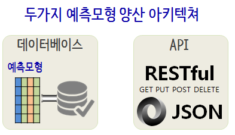

```{r, include=FALSE}
knitr::opts_chunk$set(echo = TRUE, warning=FALSE, message=FALSE)

library(tidyverse)
library(httr)
options(scipen = 999)
options(dplyr.width = 120)
options(dplyr.print_max = 1e9)
```


# 1. 예측모형 양산환경

[How do I expose R code as a web service?](https://www.quora.com/How-do-I-expose-R-code-as-a-web-service)

웹에서 R을 돌리는 방법으로 [plumber](https://github.com/trestletech/plumber)가 대세가 되고 있다. 

- `plumber`: [Turn your R code into a web API](https://github.com/trestletech/plumber)



기계학습, 딥러닝을 통해 학습한 예측모형을 양산환경으로 배포할 경우 다음의 두가지 아키텍쳐가 가능하다.
일반적인 상용 웹사이트 사례를 들어 예측모형 양산환경에 대해서 살펴보자.

|구분|      데이터베이스            |         RESTful API          |
|----|:-----------------------------|:-----------------------------|
|장점| 데이터베이스 테이블을 단순히 병합(Join)하면 되기 때문에 속도가 매우 빠름 | 유닉스 철학에 따라 예측서비스를 독자적 수행이 가능 |
|단점| 커플링 되어 있어 일부 코드 변경을 위해서 시간이 추가로 소요되고, 한가한 시간에 배치로 테이블 예측값을 주기적 갱신 | 속도가 늦을 수 있으나 대부분의 웹사이트는 비동기식 통신을 통해 예측모형 외에 다양한 서비스를 조합해서 서비스함 |

RESTful API로 예측모형 양산 서비스를 제공할 경우 복잡한 예측모형만큼이나 난잡한 예측모형 양산 서비스를 이해하기 쉽게 할 수 있고,
유지보수하기도 쉽고, 예측모형에 대한 버젼관리 뿐만 아니라 모니터링도 한결 수월하게 진행할 수 있다.

# 2. RESTful API 개발 환경

기계학습 예측모형을 예측하려는 변수를 연속형 변수와 범주형변수로 나눠 적절한 모형 아키텍처를 선택하고 나서 
예측모형의 성능을 나타내는 지표 `RMSE`, `ROC AUC`, 정확도(accuracy)등을 가지고 모형의 복잡성 등을 평가하고 나서 
최적의 예측모형을 선택한다. `xgBoost`, `Random Forest`, `GBM`, `CART`, `GLM` 등이 예측모형이 될 수 있다.

다음 단계로 이를 `RESTful` API로 변환을 시킨다.


예를 들어 `plumber`를 RESFtul API 기본 서버로 지정하는 경우 로컬컴퓨터에서 `httr` 팩키지가 지원하는 `GET`, `POST` 함수를 
활용하여 `plumber` 팩키지가 R 코드를 서비스로 제공하도록 개발환경을 구축한다.

로컬 컴퓨터에 `plumber` 개발환경을 구축하는 방법은 다음과 같이 단순하다.

`devtools::install_github("trestletech/plumber")` 명령어로 R코드를 RESTful API로 제공하는 팩키지를 설치한다.
제공할 서비스를 `myfile.R` 파일에 담아 넣고 `POST`, `GET`으로 서비스를 명세한다.
`r$run(port=8000)` 명령어를 실행해서 `myfile.R` 파일에 담아 놓은 서비스를 RESTful API로 제공한다.


```{r plumber-local, eval=FALSE}
# devtools::install_github("trestletech/plumber")
# install.packages("KoNLP")
library(plumber)
library(KoNLP)
r <- plumb("code/myfile.R") 
r$run(port=8000)
#Starting server to listen on port 8000
#Running the swagger UI at http://127.0.0.1:8000/__swagger__/
```


## 3. 예측 모형 개발 

기계학습 예측모형 개발에 대한 독일신용평가 데이터를 활용한 모형개발 사례는 [xwMOOC 기계학습 - 모형식별 및 선택 (yardstick)](http://statkclee.github.io/ml/ml-model-selection.html)을 
참조한다.

그외 예측모형 개발 기계학습에 대한 일반적인 내용은 다음 xwMOOC 웹페이지를 참조한다.

- [xwMOOC 기계학습 - 데이터 과학자가 바라본 기계학습](http://statkclee.github.io/ml/)
- [R 병렬 프로그래밍 - 신용위험 확률(plumber) API](http://statkclee.github.io/parallel-r/r-credit-score-api.html)
- [R 병렬 프로그래밍 - R 양산환경(plumber) - 타이타닉](http://statkclee.github.io/parallel-r/r-in-production-plumber.html)

- [analogsea: Interface to 'Digital Ocean'](https://cran.r-p


<div class = "row">
  <div class = "col-md-6">
- **Plumber Server Provisioning on DigitalOcean**

<iframe width="300" height="180" src="https://www.youtube.com/embed/OiREOPog3Cs" frameborder="0" allow="autoplay; encrypted-media" allowfullscreen></iframe>

  </div>
  <div class = "col-md-6">
- **Adding HTTPS to Plumber on DigitalOcean**

<iframe width="300" height="180" src="https://www.youtube.com/embed/EpgdrRTBZwg" frameborder="0" allow="autoplay; encrypted-media" allowfullscreen></iframe>

  </div>
</div>


# 3. RESTful API 테스트


## 2. 헬로월드

`hello_world` 함수를 `/hello_world` 서비스로 제공

``` {r plumber-restful-api-hello-world, eval=FALSE}
#* @get /hello_world
hello_world <- function() {
    return("안녕하세요... 반갑습니다.")
}
```

### 2.2. 헬로월드 서비스 호출 및 테스트 


```{r plumber-restful-api-hello-world-test}
# 0. 환경설정 ---------------------------------
library(httr)
library(tidyverse)

# 1. 헬로 월드: GET ---------------------------------
GET("http://localhost:8000/hello_world") %>% 
    content()
```

## 3. 매개변수 넘기는 경우

POST를 전통적으로 `?`로 시작해서 인자를 넘긴다고 지정하고 다수 매개변수를 넘길 때 매개변수를 `&`로 구분해서 넘긴다.

혹은 POST 내부 인자로 `query`를 사용해서 `list` 자료형으로 넘기는 것도 가능하고,
`path`에 지정하는 것도 가능하다.

### 3.1. 매개변수 넘기는 API  

``` {r plumber-restful-api-parameter, eval=FALSE}
#* @post /sum_two
plus_operation <- function(a, b) {
    return(list(result = as.numeric(a) + as.numeric(b)))
}

#* @get /iris/<sp>/<n:int>
function(n, sp) {
    iris %>% dplyr::filter(Species == sp) %>% 
        .[as.integer(n), ]
}
```

### 3.2. 매개변수 넘기는 API 테스트 


``` {r plumber-restful-api-parameter-test}
# 2. 매개변수 넘기기: POST ---------------------------------
## 2.1. 매개변수 2개 넘겨 더하기
POST("http://localhost:8000/sum_two?a=1&b=2") %>% 
    content()

POST("http://localhost:8000/sum_two", query=list(a=1, b=3)) %>% 
    content()

## 2.2. 깔끔한 매개변수 넘기기
GET("http://localhost:8000", path = "iris/virginica/3") %>% 
    content()
```

## 4. 그래프 

### 4.1. 그래프 시각화를 하는 API  

R의 강점인 그래프도 가능하다.

``` {r plumber-restful-api-graph, eval=FALSE}
#* @get /ggplot2_density
#* @png

ggp2dens <- function(seed = rnorm(1), fill.colour = "tomato", alpha = 1) {
    library(ggplot2)
    set.seed(seed)
    p <- data.frame(x = rnorm(100)) %>% ggplot(aes(x)) + 
        geom_density(fill = fill.colour, alpha = alpha)
    print(p)
}
```

### 4.2. 그래프 시각화를 하는 API  테스트

``` {r plumber-restful-api-graph-test}
# 3. 그래프 ---------------------------------
plot(0:1, 0:1, type = "n")
GET("http://localhost:8000/ggplot2_density?seed=77&fill.colour=tomato&alpha=0.5") %>% 
    content() %>% rasterImage(0, 0, 1, 1)
```

## 5. JSON 형태로 매개변수를 넘기는 API코드와 데이터

인자를 JSON 파일형태로 지정하여 파일로 넘기는 경우 인자를 JSON으로 정리한다.

> ### data.json
> 
> `{"Status.of.existing.checking.account": "A11", "Duration.in.month": 12, "Credit.history": "A32", "Savings.account.bonds": "A63"}`

``` {r plumber-restful-api-json, eval=FALSE}
#* @post /predict
predict.default.rate <- function(
    Status.of.existing.checking.account
    , Duration.in.month
    , Credit.history
    , Savings.account.bonds
) {
    data <- list(
        Status.of.existing.checking.account=Status.of.existing.checking.account
        , Duration.in.month=Duration.in.month
        , Credit.history=Credit.history
        , Savings.account.bonds=Savings.account.bonds
    )
    prediction <- predict(decision.tree, data)
    return(list(default.probability=unbox(prediction[1, 2])))
}
```

### 5.2. JSON 형태 파일을 받는 API 테스트 

``` {r plumber-restful-api-json-test}
# 4. 파일 ---------------------------------
## 4.1. JSON 파일: 레코드 1개
# curl --data "@data.json" localhost:8000/predict

POST("http://localhost:8000/predict", body=upload_file("code/data.json")) %>%
    content()
```


